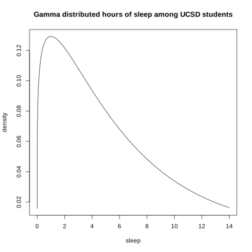
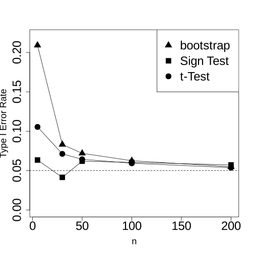
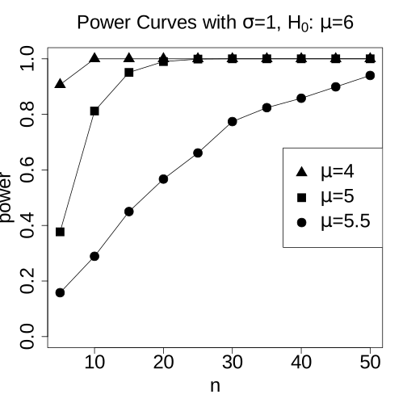

# Lab 2: Type I Error Rate and Power (Lectures 2 - 4)

In this lab, we will continue working with R to explore the concepts of Type I Error rates and Statistical Power.


```R
# Please run this initialization cell
library(ottr)
```

## Part 1: Type I Error Rate and Sample Size
In Lectures \#2 and \#3, we saw examples of various statistical tests having poor Type I Error rates. One thing to note was that these examples from class had very small sample sizes (specifically, n=5). Here, we will explore what happens over a variety of sample sizes.

### Gamma distributed data
In class, we simulated hours of sleep from a Gamma(1.2, 5) distribution, with a theoretical probability distribution that looks like this:


```R
# Run this code cell
x <- seq(0.00001, 14, by=0.01)
y <- dgamma(x, shape=1.2, scale=(6/1.2))
plot(y ~ x, type='l', xlab="sleep", ylab="density", main="Gamma distributed hours of sleep among UCSD students")
```


    

    


Specifically, we simulated samples of n=5 coming from this distribution and investigated the Type I Error rates of a variety of statistical tests all trying to answer:

$$
\begin{aligned}
H_0\colon \mu = 6 \\
H_A\colon \mu \neq 6
\end{aligned}
$$

To make sure that we recall what we already saw in class, please answer the following.

**Question 1.1.** Which of the following best indicates what we observed in class regarding samples of size n=5 from a Gamma distribution when running tests to answer the question posed with the above statistical hypotheses?

1. A t-Test had an inflated Type I Error rate above its nominal Type I Error rate because a t-Test relies on the sample mean having a normal distribution, and here it does not.
2. A t-Test attained its nominal Type I Error rate due to the Central Limit Theorem since the parameter of interest is the mean.
3. A sign test had an inflated Type I Error rate above its nominal Type I Error rate because $0.0625 + \epsilon$ was the lowest significance level possible in this case.
4. A sign test had an inflated Type I Error rate because nonparametric tests may have less statistical power than parametric tests.
5. A sign test attained its nominal Type I Error rate because it does not rely on any distributional assumptions on the data.

Select all that are correct and store your choice(s) as a vector into `typei` below (recall that vectors in R take the form `c(x1, x2, ...)`). If multiple options are correct, please put them in the vector in ascending order (smallest to largest). 


```R
typei <- c(1,5) # YOUR CODE HERE
```


```R
. = ottr::check("tests/q1_1.R")
```

    All tests passed!

If you did not get the above question correct on the first try, or if you were not totally confident in your answer, please review the Lecture \#2 and \#3 slides and podcast before proceeding to the following questions.

**Question 1.2.** Let us now simulate larger sample sizes to see how these tests behave. Fill in the necessary code to estimate the Type I Error rate of performing a t-Test on samples of size n=30 from the same Gamma distribution from lecture (and shown above). 


```R
set.seed(112) # DO NOT DELETE OR CHANGE THIS LINE!
count <- 0

for(i in 1:10000){
  gam_data <- rgamma(n = 30, shape = 1.2, scale = 6/1.2) # YOUR CODE HERE
  p.val <- t.test(gam_data, mu = 6)$p.value # YOUR CODE HERE
  if(p.val < 0.05){
    count <- count + 1
  }
}

TypeI <- count / 10000
TypeI
```


0.0674


```R
. = ottr::check("tests/q1_2.R")
```

    All tests passed!

**Question 1.3.1.** Now recall the sign test from Lecture \#3. Here is a function to perform the sign test (similar to what you likely wrote for Your Turn \#1 in Daily Check \#3, but with some additional flexibility):


```R
# Carefully recall that the sign test is a test for the median (not the mean)
# So, m0 refers to the null hypothesis value of the median

signtest <- function(values, m0, n){
  x <- sum(values < m0)
  y <- sum(values > m0)
  return(pbinom(min(x,y), size=n, prob=0.5)*2)
}
```

Now, recall from class that with a sample size of n=5, the closest $\alpha$ level to 0.05 that could be attained was $0.0625 + \epsilon$, due to the discrete nature of the rejection region. Using the `pbinom` function, find (via trial and error) the closest significance level to 0.05 that can be attained with a sign test on data of size n=30, and store it into the variable `alpha` (do not worry about the $\epsilon$ term, and also do not worry about whether it is above or below 0.05; we just want it to be as close as possible in either direction).

Hint: your task is basically to determine what p-values are possible in this situation. 


```R
alpha <- 2 * pbinom(9, size = 30, prob = 0.5) # YOUR CODE HERE
alpha
```


0.0427739452570677


```R
. = ottr::check("tests/q1_3_1.R")
```

    All tests passed!

**Question 1.3.2.** In class, we already saw that the sign test attained its nominal $\alpha$ level with a sample size as small as n=5, so it stands to reason that with n=30, it also will be fine. Let's just double-check though. Fill in the required code in the cell below to:

 - Simulate a sample of size 30 coming from the Gamma distribution with a median of 6 (see Lecture \#3 Slide 12 if you forget what needs to happen to achieve that) and store it as `gam_data`
 - Run a sign test on `gam_data`
 - Find the proportion of times that the sign test gives a Type I Error


```R
set.seed(112) # DO NOT DELETE OR CHANGE THIS LINE!
count <- 0
epsilon <- 0.0001 # this may be useful somewhere in your code below

for(i in 1:10000){
  gam_data <- rgamma(30, shape = 1.2, scale = 6 / qgamma(0.5, shape = 1.2, scale = 1)) # YOUR CODE HERE
  p.val <- signtest(gam_data, m0 = 6, n = 30) # YOUR CODE HERE
    if(p.val < alpha + epsilon){
    # YOUR CODE HERE
    count <- count + 1
  }
}

TypeI_gam <- count / 10000
TypeI_gam
```


0.0418


```R
. = ottr::check("tests/q1_3_2.R")
```

    All tests passed!

**Question 1.4.** Now recall the hypothesis test using the bootstrap confidence interval. We saw in class that it performed horribly on the Gamma data with n=5. Now let's see how it does with n=30.

Since the bootstrap confidence interval is for the mean (not the median as the sign test is), we will revert back to simulating under the same Gamma distribution as in **Question 1.2.**

Take your code from Your Turn \#2 in Lecture \#3, and modify it to simulate samples of size 30 and estimate the Type I Error rate with that sample size. Recall that it may take approximately 30-45 seconds to run. 


```R
count <- 0

for(j in 1:1000){
  gam_data <- rgamma(n=30, shape=1.2, scale=(6/1.2)) # SOLUTION
  boot_means <- NA
  
  for(i in 1:1000){
    boot_means[i] <- mean(sample(gam_data, replace=TRUE))
  }
  
  ci <- quantile(boot_means, probs=c(0.025, 0.975))
  if(ci[1] > 6 | ci[2] < 6){
    count <- count + 1
  }
}

TypeI_boot <- count / 1000
TypeI_boot
```


0.084


```R
. = ottr::check("tests/q1_4.R")
```

    All tests passed!

**Question 1.5.** Overall in this question, we have seen that the larger sample size of n=30 gives us some improvement in the Type I Error rate as compared to the n=5 that we saw in lecture, though still not perfect. Below, simulations at a variety of sample sizes have already been run. The dotted horizonal line is at 0.05.


```R
# Run this code and be sure not to change it!
load("typei_vs_n.RData")

plot(TypeI_tt[1:5] ~ n[1:5], pch=19, ylim=c(0, 0.22), ylab="Type I Error Rate", xlab="n",
     cex.main=2, cex.lab=1.5, cex.axis=2, cex=2)
lines(TypeI_tt[1:5] ~ n[1:5])
points(TypeI_st[1:5] ~ n[1:5], pch=15, cex=2)
lines(TypeI_st[1:5] ~ n[1:5])
points(TypeI_bs[1:5] ~ n[1:5], pch=17, cex=2)
lines(TypeI_bs[1:5] ~ n[1:5])
abline(h=0.05, lty=2)
legend("topright", pch=c(17, 15, 19), legend=c("bootstrap", "Sign Test", "t-Test"), cex=2)
```


    

    


Which of the following best describes what you observe above?

1. Due to the Central Limit Theorem, the t-Test attains proper Type I Error Rates of 0.05 at $n \geq 30$.
2. With skewed data, a true Type I Error rate of 0.05 is difficult to achieve with any of these statistical tests, even with moderately large sample sizes.
3. Non-parametric tests always perform better than parametric tests when the distributional conditions of the parametric test are not met.
4. With a nominal significance level of 0.05, a large enough sample size would ultimately reduce the true Type I Error Rate to 0.

Assign the variable `typeI_n` to 1, 2, 3 or 4 based on your choice.


```R
typeI_n <- 2 # YOUR CODE HERE
```


```R
. = ottr::check("tests/q1_5.R")
```

    All tests passed!

## Part 2: Statistical Power

In Lecture \#4, we discussed how statistical power can be thought of as:

> The probability of correctly rejecting $H_0$.

In other words, statistical power is the probability of rejecting $H_0$ when $H_A$ is actually the truth.

Again as discussed in class, the conceptual difficulty with power calculations is that it requires you to assume some true effect size, when we don't actually know what the true effect size is. That is, there are typically infinite possibilities within $H_A$, so the question of knowing *which* of these possibilities within $H_A$ to choose is a problem!

**Question 2.1.** Which of the following are possible approaches for estimating the effect size for power calculations, as discussed in class?

1. Literature Review
2. Book Review
3. Pilot Study
4. Engineer Study
5. Driver Study
6. Ad-hoc
7. Pre-hoc
8. Post-hoc

Select all that are correct and store your choice(s) as a vector into `effsize` below (recall that vectors in R take the form `c(x1, x2, ...)`). If multiple options are correct, please put them in the vector in ascending order (smallest to largest). 


```R
effsize <- c(1,3,8) # YOUR CODE HERE
```


```R
. = ottr::check("tests/q2_1.R")
```

    All tests passed!

**Question 2.2.** Now, in Lecture \#4, we wrote a function that simulates estimates of statistical power for any given input of sample size, effect size and standard deviation (while still assuming that the data come from a normal distribution). Put that function in the code cell below, and then run it on the test case.


```R
# YOUR CODE HERE
sim_power_t <- function(n, delta, sd, reps = 1000){
  count <- 0

  for(i in 1:reps){
    sim_data <- rnorm(n = n, mean = delta, sd = sd)
    p.val <- t.test(sim_data, mu = 0)$p.value
    
    if(p.val < 0.05){
      count <- count + 1
    }
  }
  
  count / reps
}


set.seed(112) # DO NOT DELETE OR CHANGE THIS LINE!
test_power <- sim_power_t(n=10, delta=0.5, sd=1, reps=10000)
test_power
```


0.2939


```R
. = ottr::check("tests/q2_2.R")
```

    All tests passed!

**Question 2.3.** Now, we would like to use this function to create the power curves seen in Lecture \#4. Fill in the code cell below to do the following:

 - Assign a variable `delta` to be a vector of all effect sizes in the plot, from smallest to biggest
 - Assign a variable `n` to be a vector of all of the sample sizes in the plot, from smallest to biggest
 - Assign a variable `powers` to be a matrix of `NA` values, and dimensions of (# of `delta`s, # of `n`s)
 - In the loop, fill in the `powers` matrix using the function from the previous question, and appropriate indices on `power`, `delta` and `n`
 - In the `sim_power_t` function, use `reps=1000` instead of 10000 as in class; this will make it run faster, and it will still be good enough. With 1000 repetitions, it should finish within a couple of seconds; otherwise, there is probably a bug in your code.


```R
# YOUR CODE HERE
delta <- c(0.5, 1, 2)
n <- seq(5, 50, 5)
powers <- matrix(NA, nrow = length(delta), ncol = length(n))

for(i in 1:length(delta)){
  for(j in 1:length(n)){
      powers[i, j] <- sim_power_t(n = n[j], delta = delta[i], sd = 1, reps = 1000)
    # YOUR CODE HERE
  }
}
```

Then, run the following code to make the plot. 


```R
# Plot the power curves -- do not change the code below!
plot(powers[1,] ~ n, pch=19, ylim=c(0,1), ylab="power", main=expression(paste("Power Curves with ", 
                                                                              sigma, "=1, ", H[0], ": ", mu, "=6")), 
     cex.main=2, cex.lab=2, cex.axis=2, cex=2)
lines(powers[1,] ~ n)
points(powers[2,] ~ n, pch=15, cex=2)
lines(powers[2,] ~ n)
points(powers[3,] ~ n, pch=17, cex=2)
lines(powers[3,] ~ n)
legend("right", pch=c(17, 15, 19), legend=c(expression(paste(mu, "=4")), 
                                            expression(paste(mu, "=5")), 
                                            expression(paste(mu, "=5.5"))), cex=2)
```


    

    


```R
. = ottr::check("tests/q2_3.R")
```

    All tests passed!

Note that the above plot is still under the normal distribution. What happens to statistical power if $H_A$ is true, but the data are not from a normal distribution?

**Question 2.4.1.** Let us investigate just one possibility. Specifically, note from the power curve from above that, at $n=10$, $\delta=1$ and $\sigma=1$, the power is approximately 0.80.

Here, we will investigate what happens at that effect size but with a skewed distribution. We will again use a gamma distribution, but it is a bit tricky because, in order to make a direct comparison to the power previously calculated with the normal distribution, we need it to have the same standard deviation. And because for the gamma distribution, the mean and variance are functions of each other, we cannot simply set the mean and standard deviation to be any values of our choosing.

There are many choices for how to get around this, but here is one: we will use a shifted gamma distribution. The code below will simulate 10000 replicates from the distribution, and then show that its mean is approximately 5 (to get a $\delta$ of 1) and standard deviation is approximately 1, as desired:


```R
# Run this code, do not modify it!
gamma_data <- rgamma(n=10000, shape=2, scale=sqrt(1/2)) + (5 - 2*sqrt(1/2))
mean(gamma_data)
sd(gamma_data)
```


4.98689065166692


1.00815476290338


Modify your power function from **Question 2.2** to calculate power using this specific distribution with its effect size and standard deviation, but still at $\alpha=0.05$. Call it `sim_power_gamma`.

*Hint*: there are three things that will need to change:
 - The list of arguments for the function (you no longer need to provide the effect size and sd, since we are hard-coding the alternative distribution here)
 - The simulation of the data
 - An argument will need to be added to the call of the `t.test` function, since we are no longer approaching it by specifying `delta`


```R
# YOUR CODE HERE
sim_power_gamma <- function(n, alpha = 0.05, reps = 10000){
  count <- 0
  
  for(i in 1:reps){
    sim_data <- rgamma(n = n, shape = 2, scale = sqrt(1/2)) + (5 - 2*sqrt(1/2))
    p.val <- t.test(sim_data, mu = 6)$p.value
    
    if(p.val < alpha){
      count <- count + 1
    }
  }
  
  count / reps
}

set.seed(112) # DO NOT DELETE OR CHANGE THIS LINE!
gamma_power <- sim_power_gamma(n=10)
gamma_power
```


0.7636


```R
. = ottr::check("tests/q2_4_1.R")
```

    All tests passed!

**Question 2.4.2.** Which of the following best describes what you observed?

1. With an effect size of 1, a standard deviation of 1 and a sample size of 10, the t-Test has greater power when the data come from a normal distribution than from this shifted gamma distribution
2. With an effect size of 1, a standard deviation of 1 and a sample size of 10, the t-Test has smaller power when the data come from a normal distribution than from this shifted gamma distribution
3. With an effect size of 1,  a standard deviation of 1 and a sample size of 10, the power of the t-Test is practically equal, comparing when the data come from a normal distribution vs. from this shifted gamma distribution
4. A comparison between the power from the normal data and the shifted gamma data is not valid, because they do not have the same standard deviation. 

Select the number of your choice (1, 2, 3 or 4) and assign it to the variable `power_comparison` below.


```R
power_comparison <- 1 # YOUR CODE HERE
```


```R
. = ottr::check("tests/q2_4_2.R")
```

    All tests passed!

## Congratulations, you are finished!!

To submit your assignment:

1. Select `Kernel -> Restart Kernel and Run All Cells...` to ensure that you have executed all cells, including the test cells.
2. Read through the notebook to make sure everything is fine and all tests passed.
3. Download your notebook using `File -> Download`, then upload your notebook to Gradescope.
4. Stick around while the Gradescope autograder grades your work. Make sure you see that all tests have passed on Gradescope.
5. Check that you have a confirmation email from Gradescope and save it as proof of your submission.
