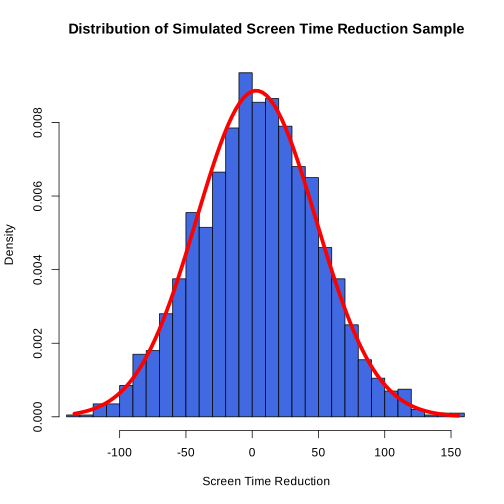
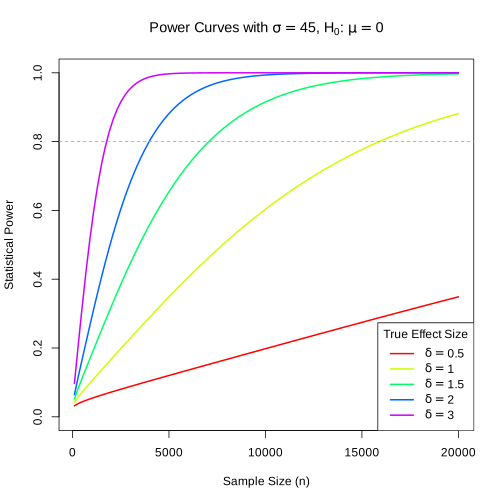
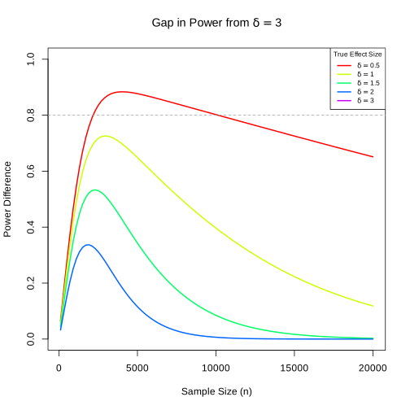
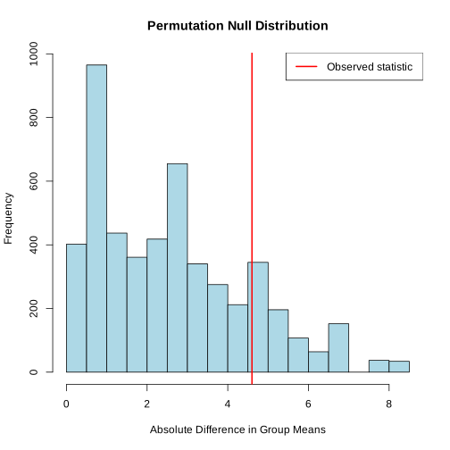
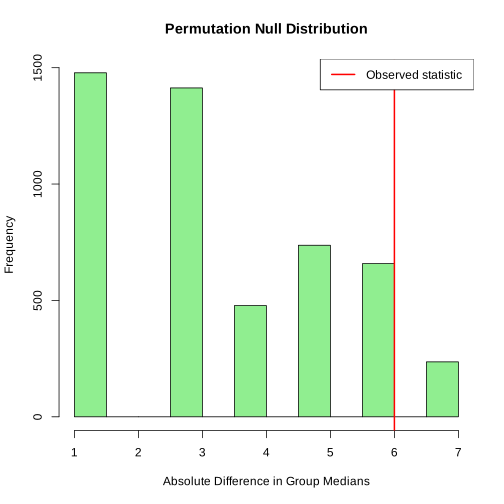
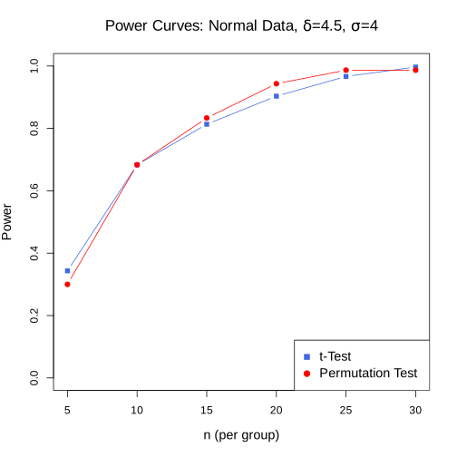
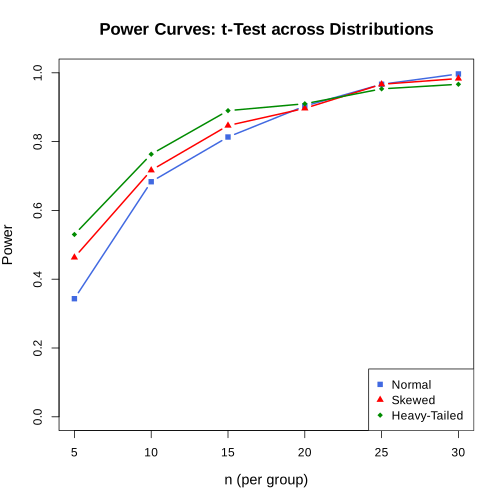
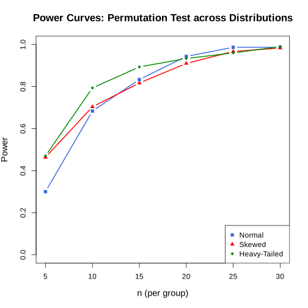

# Lab 3: Examining Statistical Significance and Permutation Testing

In this lab, we will continue working with $\mathsf{R}$ to explore the concepts of Statistical Significance (in relation to effect size) and Permutation Testing. By the end of this lab, you will (hopefully) have a clear sense of why the $p$-value alone is not sufficient to judge whether a result matters.


*REMARK: Feel free to add cells throughout the lab if you would like to test things out or to have more intermediate steps. Any answers, though, should use the variable names listed in the question.*


```R
# Please install this initialization cell
library(ottr)
```

## Part 1: Statistical Significance versus Effect Size
In Lecture \#5, we saw that as sample sizes increases, statistical power increases for *any* fixed, non-zero effect size, no matter how big or small this size is. This raises an important question: if we can eventually reject $H_0$ by collecting sufficiently large amounts of data, what does a statistically significant result actually tell us?

### Screen Time Setting
Consider a health tech company that claims their new app reduces their users' daily screen time. They ran a study to compare the change in daily screen time (in minutes) for each participant after they have been using the app. (Note: a positive value means the users' screen time was reduced, and assume their study was conducted randomly. That is, the subjects were randomly selected and each subject's app usage was independent of every other's.) We want to test: 

$$
\begin{aligned}
H_0 &: \mu = 0\qquad &&\text{(no change in overall screen time)} \\ 
H_A &: \mu \neq 0 \qquad &&\text{(some change in overall screen time)}
\end{aligned}
$$

Based on prior studies, the company realized that screen time change is highly variable, finding $\sigma \approx 45$ minutes (3/4ths of an hour) per day. Suppose that the true average reduction is $\mu = 3$ minutes per day - a small but noticeable reduction. 

To make sure that we recall what we already saw in class, please answer the following.

**Question 1.1.** Which of the following statements correctly describes the relationship between $p$-values, sample sizes, and effect sizes? 

1. As the sample size increases, statistical power increases for any fixed non-zero effect size. 
2. Failing to reject $H_0$ proves that the true effect size is exactly zero. 
3. A statistically significant $p$-value guarantees that the observed effect is large enough to be practically important.
4. A confidence interval can often convey more information about the magnitude of an effect than a $p$-value alone. 
5. For any fixed non-zero effect size, there exists a sample size $n$ sufficiently large enough such that the null hypothesis $H_0$ is rejected at $\alpha = 0.05$.

Select all that are correct and store your choice(s) as a vector into `sig_eff_size` below. If multiple options are correct, put them in the vector in ascending order (smallest to largest).


```R
sig_eff_size <- c(1, 4, 5) # YOUR CODE HERE
```


```R
. = ottr::check("tests/q1_1.R")
```

    All tests passed!

If you did not get the above question correct on the first try, or if you were not totally confident in your answer, please review the Lecture #5 slides and podcast before proceeding to the following questions. 

Let us now simulate a large dataset and run the same hypothesis test as the health tech company. In order to perform the one-sample $t$-test for the test $H_0: \mu = 0$ vs. $H_A: \mu \neq 0$, we must ensure our data come from a normal distribution.  The following cell simulates a sample of size $n = 2,000$ from a $\mathcal{N}(\mu = 3, \sigma^2 = 2025)$ distribution (recall $\sigma \approx 45$) and generates a plot of the distribution, with density function of the original distribution overlaid.


```R
set.seed(123) # DO NOT DELETE OR CHANGE THIS LINE!
app_large_sample <- rnorm(n=2000, mean=3, sd=45)
par(bg='white')
hist(app_large_sample, main="Distribution of Simulated Screen Time Reduction Sample", 
    xlab="Screen Time Reduction", breaks=30, freq=FALSE, col='royalblue',
    xlim = range(app_large_sample))
curve(dnorm(x, mean=3, sd=45), add=TRUE, col='red', lwd=5)
```


    

    


It's not perfect, but it looks like our sample is a pretty good representation of the distribution. 

**Question 1.2.1.** Using the generated `app_large_sample` from above, obtain the $p$-value from the one-sample $t$-test the health tech company was interested in running. Store your answers in `p_val_large_n`.


```R
p_val_large_n <- t.test(app_large_sample, mu = 0)$p.value # YOUR CODE HERE
p_val_large_n
```


1.87866587667228e-05


```R
. = ottr::check("tests/q1_2_1.R")
```

    All tests passed!

**Question 1.2.2.** Using the generated `app_large_sample` from above, obtain the 95% confidence interval for the mean of the `app_large_sample`. Store your interval in `ci_large_n`, which should be a numeric vector of length 2.


```R
ci_large_n <- t.test(app_large_sample, mu = 0)$conf.int # YOUR CODE HERE
ci_large_n
```


<style>
.list-inline {list-style: none; margin:0; padding: 0}
.list-inline>li {display: inline-block}
.list-inline>li:not(:last-child)::after {content: "\00b7"; padding: 0 .5ex}
</style>
<ol class=list-inline><li>2.3438669321271</li><li>6.29282343355042</li></ol>


```R
. = ottr::check("tests/q1_2_2.R")
```

    All tests passed!

**Question 1.3** Looking at both the $p$-value and the 95\% confidence interval obtained from this one-sample test, which observation best describes the results? 

1. We reject the null hypothesis $H_0$ at the significance level $\alpha = 0.05$, and the confidence interval confirms that the true effect is large and could even exceed 10 minutes (i.e., it is practically important).
2. We reject the null hypothesis $H_0$ at the significance level $\alpha = 0.05$, but the confidence interval suggests that the true effect is likely only about 2-5 minutes (i.e., it may not be practically important).
3. We fail to reject the null hypothesis $H_0$ at the significance level $\alpha = 0.05$, and the confidence level confirms that the true effect is likely not practically important (i.e., it is near zero).
4. We fail to reject the null hypothesis $H_0$ at the significance level $\alpha = 0.05$, but the confidence interval suggests that the true effect is large and could even exceed 10 minutes (i.e., it is practically important).

Assign your answer (1, 2, 3, or 4) to `interp_large_n` below.


```R
interp_large_n <- 2 # YOUR CODE HERE
```


```R
. = ottr::check("tests/q1_3.R")
```

    All tests passed!

**Question 1.4.1.** Repeat the procedure from **Question 1.2.1**, but this time on a much smaller sample of size $n = 30$. That is, generate a sample of size $n = 30$ from the same distribution $\mathcal{N}(\mu = 3, \sigma^2 = 2025)$ and run the one-sample $t$-test for the same hypothesis test as before. Store your resulting $p$-value into `p_val_small_n`. (It may help to store your generated sample in a variable `app_small_sample` before you perform the test.)


```R
set.seed(123) # DO NOT DELETE OR CHANGE THIS LINE!
# YOUR CODE HERE
app_small_sample <- rnorm(n = 30, mean = 3, sd = 45)
p_val_small_n <- t.test(app_small_sample, mu = 0)$p.value
p_val_small_n
```


0.913778422616381


```R
. = ottr::check("tests/q1_4_1.R")
```

    All tests passed!

**Question 1.4.2.** Compare `p_val_large_n` (from $n = 2000$) with `p_val_small_n` (from $n = 30$). If the true effect size is as described in **Screen Time Setting**, which statement best explains the difference in the $p$-values? 

1. With $n = 30$, the mean of the simulated sample happens to be smaller. This decreased the test statistic and increased the $p$-value, leading to a smaller observed effect. 
2. With $n = 30$, the standard deviation of the simulated sample happens to be higher. This widened the distribution of the test statistic, leading to a larger $p$-value.
3. With $n = 2000$, the uncertainty of the simulated sample is reduced due to a lower standard error. This provides stronger evidence against the null $H_0$, despite the true effect size being the same.
4. The produced $p$-values are driven by randomness and sampling variability. This means that if we were to run the experiment again, the roles of the produced $p$-values might be reversed. 

Assign your answer (1, 2, 3, or 4) to `p_val_comparison` below.


```R
p_val_comparison <- 3 # YOUR CODE HERE
```


```R
. = ottr::check("tests/q1_4_2.R")
```

    All tests passed!

**Question 1.5.1.** Having seen the results of their previous study, one of the company's statisticians wants to design a future study to reliably detect the true effect of $\delta = 3$ minutes of reduced screen time (with $\sigma = 45$ minutes) at a significance level of $\alpha = 0.05$. Compute the minimum sample size required to achieve 80\% power for this two-sided one-sample $t$-test. Round up your answer to the nearest integer and store your answer in `n_required`.

*Hint*: Review the poker example in Lecture \#5 where we talked about the `power.t.test()` function.


```R
n_required <- ceiling(
  power.t.test(delta = 3, sd = 45, sig.level = 0.05, power = 0.80,
               type = "one.sample", alternative = "two.sided")$n
) # YOUR CODE HERE
n_required
```


1768


```R
. = ottr::check("tests/q1_5_1.R")
```

    All tests passed!

**Question 1.5.2.** Despite what the statistician says, a company executive believes the true effect is considerably smaller: $\delta = 0.5$ minutes (or 30 seconds) of reduced screen time per day per user. Determine the statistical power of a two-sided one-sample $t$-test with $n = 5,000$, $\sigma = 45$, and $\delta = 0.5$ at the significance level $\alpha = 0.05$.

Then, based on your obtained power, select which of the following best characterizes the situation for detecting a 30-second screen-time reduction at about 80\% power. (*Hint: Having computed the power already, you **SHOULD NOT NEED** to write any additional lines of code to answer this question.*) 

1. It appears that a study with a small sample size, say 500 subjects, is most appropriate. Such a study would be feasible and relatively cheap for the tech company.
2. It appears that a study with a medium sample size, say 5,000 subjects, is most appropriate. Such a study would be feasible but expensive for the tech company.
3. It appears that a study with a much larger sample size, say 65,000 subjects, is most appropriate. For such a study, the tech company should reconsider whether a 30-second reduction is something worth caring about.
4. Statistical power is independent of sample size. This means that the tech company can choose a reasonable number of subjects given the budget for their future study.

Record your computed statistical power in `power_tiny_effect` and the answer to this question (1,2,3, or 4) in `power_tiny_conclusion`.


```R
power_tiny_effect <- power.t.test(
  n = 5000, delta = 0.5, sd = 45, sig.level = 0.05,
  type = "one.sample", alternative = "two.sided"
)$power # YOUR CODE HERE
power_tiny_effect

power_tiny_conclusion <- 3 # YOUR CODE HERE
power_tiny_conclusion
```


0.120109273310017


3


```R
. = ottr::check("tests/q1_5_2.R")
```

    All tests passed!

As we saw both in Lab \#2 and in Lectures \#4 and \#5, we can plot power curves to understand how the power changes for each true effect size $\delta$ as the sample size increases. Given some of the answers to the previous questions, it should come as no surprise that the power curve when $\delta = 0.5$ remains well below the power curve when $\delta = 3$. Run the cell to see for yourself by just how much the two power curves differ, especially at small sample sizes. (The grey dotted lines correspond to our desired 80% power.)


```R
# Define parameters for plots
n_values <- seq(from=100, to=20000, length.out=100)
deltas <- c(0.5, 1, 1.5, 2, 3)
sd_val <- 45

# Plot 1 (standard power curves)
par(bg='white')
plot(NULL, xlim = range(n_values), ylim = c(0, 1),
     xlab = "Sample Size (n)", ylab = "Statistical Power",
     main = expression(paste("Power Curves with ", sigma == 45, ", ", H[0], ": ", mu == 0)))
colors <- rainbow(length(deltas))
for (i in seq_along(deltas)) {
  # Calculate power for each n in the range for the current delta
  powers <- sapply(n_values, function(n) {
    power.t.test(n = n, delta = deltas[i], sd = sd_val, 
                 sig.level = 0.05, type = "one.sample")$power
  })
  # Add the line to the plot
  lines(n_values, powers, col = colors[i], lwd = 2)
}
# Add legend to plot
legend_labels <- sapply(deltas, function(d) as.expression(bquote(delta == .(d))))
legend("bottomright",  legend = legend_labels,  col = colors, lwd = 2, 
       title = "True Effect Size")
abline(h = 0.8, lty = 2, col = "darkgrey")   # Add horizontal line for 80% power

# Plot 2 (power gaps)
par(bg='white')
plot(NULL, xlim = range(n_values), ylim = c(0, 1),
     xlab = "Sample Size (n)", ylab = "Power Difference",
     main = expression(paste("Gap in Power from ", delta == 3)))
# Pre-calculate baseline power for delta = 3
baseline_p <- sapply(n_values, function(n) {
  power.t.test(n = n, delta = 3, sd = sd_val, type = "one.sample")$power
})
for (i in 1:(length(deltas)-1)) {
  current_p <- sapply(n_values, function(n) {
    power.t.test(n = n, delta = deltas[i], sd = sd_val, type = "one.sample")$power
  })
  lines(n_values, baseline_p - current_p, col = colors[i], lwd = 2)
}
# Add legend to plot
legend("topright", legend = legend_labels, col = colors[1:5], 
        lwd = 2, cex = 0.7, title = "True Effect Size")
abline(h = 0.8, lty = 2, col = "darkgrey")    # Add horizontal line for 80% power difference
```


    

    


    

    


**Question 1.6.** Instead of relying on just the raw effect size $\delta$, which is reported in minutes and can be hard to interpret easily (really how much of a difference does $\delta = 2$ make from $\delta = 1.5$, say?), let us also consider another more standardized measure called Cohen's $d$, named after the American psychologist and statistician Jacob Cohen. The measure, in the one-sample case, is defined as: 
$$ d = \frac{|\overline{x} - \mu_0|}{s},$$ 
where $s$ is the sample standard deviation and $\mu_0$ the mean under the null hypothesis. (In our context, a score of $d = 1$ corresponds to a screen time reduction that is one standard deviation from the mean.)

Practicioners have established some thresholds (benchmarks) for how to interpret these scores: $d \in [0, 0.2)$ is typically classified as "small", $d \in [0.2, 0.8)$ is typically classified as "medium", and $d \geq 0.8$ is typically classified as "large" effect size. While these thresholds are pretty arbitrary, Cohen initially proposed these benchmarks based on some studies he did on human heights and IQ scores. Moreover, these thresholds are by no means universal: in the poker example from Lecture \#5, an effect size of $\$0.10$ will yield a Cohen $d$-value of $d \approx 1.4$ (when the standard deviation is 7), indicating a seemingly small raw effect size could be classified as "large" effect size. This makes it "meaningful" in that, if it were real, such a raw effect size would result in a lot of money being won in the long run. 

For our setting, we can ignore the potential issues with this framing of effect size and instead try to understand the measure as an standardized alternative to  $\delta$. Implement the function `cohens_d_func` which takes as input a vector `my_data` and a mean `mu_0`, where `mu_0` is the true population mean under the assumption the null $H_0$ is true. Your function should return `NA` if the standard deviation of the data is 0. Otherwise, it should return both the value for $d$ and a loose classification for the standardized effect size ("small", "medium", or "large") as a vector.

Because Cohen's $d$ is biased for small samples, obtain a value for $d$ using `app_large_sample`. Store the result of your function in the vector `cohens_d_results` such that `cohens_d_results[1]` is your obtained value for $d$ and `cohens_d_results[2]` is your loose classification.


```R
# YOUR CODE HERE
cohens_d_func <- function(my_data, mu_0) {
  s <- sd(my_data)
  
  if (s == 0) {
    return(NA)
  }
  
  d <- abs(mean(my_data) - mu_0) / s
  
  label <- if (d < 0.2) {
    "small"
  } else if (d < 0.8) {
    "medium"
  } else {
    "large"
  }
  
  c(d, label)
}

# Apply the function to the large sample
cohens_d_result <- cohens_d_func(app_large_sample, 0) # YOUR CODE HERE
cohens_d_result
```


<style>
.list-inline {list-style: none; margin:0; padding: 0}
.list-inline>li {display: inline-block}
.list-inline>li:not(:last-child)::after {content: "\00b7"; padding: 0 .5ex}
</style>
<ol class=list-inline><li>'0.0959093900375731'</li><li>'small'</li></ol>


```R
. = ottr::check("tests/q1_6.R")
```

    All tests passed!

#### This is the end of the material covered in Quiz \#1 (Lectures 1 through 5).

## Part 2: More Detailed Permutation Testing

In Lecture \#6, we revisited the permutation test and explained how it is a non-parametric alternative to a two-sample $t$-test. Importantly, it does not require any distributional assumptions (unlike the $t$-test), and it builds a null distribution by repeatedly shuffling (permuting) the group labels and recomputing the test statistic. In this part of the lab, we will follow up on that discussion by looking at permutation tests in two new contexts, namely with a different test statistic and with data that emerges from non-normal distributions. 

**Question 2.1.** Welch's two-sample $t$-test is the standard approach for comparing the means of two independent groups since it does not assume the groups have equal variances. Which of the following conditions are rquired for this test to be valid (i.e., for it to attain its nominal Type I error rate)? 

1. The data in each group must come from a population that is normally distributed, and, if not, the sample size must be large enough for the Central Limit Theorem to apply.
2. The two groups must have the same sample size (i.e., $n_1 = n_2$).
3. The true population standard deviation $\sigma$ must be the same in both groups.
4. The observations must be independent within each group and independent between the two groups.
5. The data must be collected through a random assignment of participants to each of the groups. 

Select all that are correct and store your choice(s) as a vector `ttest_conditions`. If multiple options are correct, put them in the vector in ascending order (smallest to largest).


```R
ttest_conditions <- c(1, 4) # YOUR CODE HERE
```


```R
. = ottr::check("tests/q2_1.R")
```

    All tests passed!

If you did not get this question correct on your first try or were a little confused, please review the pollev question from Lecture \#6. 

For the first new context, in which we explore another test statistic, we will use the same fictional dataset from Lecture \#6. Run the cell below to create it.


```R
# Run this cell -- do not modify!
set.seed(4162026)
hand_code_df <- data.frame(
  score = c(2, 5, 3, -3, 8, 9, 10, -1, 14, 6),
  group = c(rep("handwritten", 5), rep("coding", 5))
)
```

**Question 2.2.** If $\mu_\mathrm{coding}$ denotes the true mean of those who were tasked with doing the coding exercises and $\mu_\mathrm{handwritten}$ denotes the true mean of those who were tasked with doing the hand-written exercises, run a two-sample $t$-test on `hand_code_df` to test: 

$$
H_0: \mu_\mathrm{coding} = \mu_\mathrm{handwritten} \quad\text{vs.}\quad H_A: \mu_\mathrm{coding} \neq \mu_\mathrm{handwritten}
$$

Store the $p$-value as `p_val_ttest`.


```R
p_val_ttest <- t.test(score ~ group, data = hand_code_df)$p.value # YOUR CODE HERE
p_val_ttest
```


0.1786855849387


```R
. = ottr::check("tests/q2_2.R")
```

    All tests passed!

**Question 2.3.** In class, we implemented a permutation test using the difference in group means. To simplify the loop we will use for our permutation test, write a function `diff_in_means` that takes as input a dataframe `df` and returns the absolute difference in group means. Apply this function on `hand_code_df` and obtain an observed test statistic for our permutation test.

For simplicity, assume the first column in `df` contains numeric values (say, scores) and the second contains group labels. You can access column `i` by doing `df[[i]]`.

Note: This function should be almost identical to one of the functions you wrote in Your Turn \#1 from Lecture \#6. 

*Hint:* The function `tapply(values, groups, f)` applies the function `f` to each group in `groups`, while the function `unname(obj)` removes the name attribute of an $\mathsf{R}$ object and leaves only its numeric value. Both may be helpful in your implementation. 


```R
diff_in_means <- function(df) {
  group_means <- unname(tapply(df[[1]], df[[2]], mean))
  abs(group_means[1] - group_means[2])
# YOUR CODE HERE
}

# Apply your function to the original data to get the observed test statistic
obs_test_stat <- diff_in_means(hand_code_df) # YOUR CODE HERE
obs_test_stat
```


4.6


```R
. = ottr::check("tests/q2_3.R")
```

    All tests passed!

**Question 2.4.** Recall that, under the assumption the null hypothesis $H_0$ is true, the group labels are arbitrary, meaning that if we were to reassign them randomly, the test statistic should look like it came from the null distribution. 

Take the rest of your code from Your Turn \#1 in Lecture \#6, and modify it to (a) make use of the `diff_in_means` function you just wrote and to (b) perform 5,000 permutations. Compute the permuted test statistic for each permutation and add each to the vector `perm_stats`. Based on `perm_stats`, obtain the permutation $p$-value, which is the proportion of permuted test statistics in `perm_stats` which are *greater than or equal to* the observed test statistic `obs_test_stat`. Store this $p$-value in `p_val_perm`. 


```R
set.seed(123) # DO NOT DELETE OR CHANGE THIS LINE!
# YOUR CODE HERE

perm_stats <- replicate(5000, {
  shuffled_df <- hand_code_df
  shuffled_df[[2]] <- sample(shuffled_df[[2]])
  diff_in_means(shuffled_df)
})


# Compute permutation p-value
p_val_perm <- mean(perm_stats >= obs_test_stat) # YOUR CODE HERE
p_val_perm

```


0.187


Run the following code cell to visualize the null distribution from your permutation test. The red vertical line marks the observed test statistic, `obs_test_stat`. Take a second to think about what you observe.


```R
# Run this cell -- do not modify!
par(bg='white')
hist(perm_stats, col="lightblue", main="Permutation Null Distribution", xlab="Absolute Difference in Group Means")
abline(v=obs_test_stat, col="red", lwd=2)
legend("topright", legend="Observed statistic", col="red", lwd=2)
```


    

    


```R
. = ottr::check("tests/q2_4.R")
```

    All tests passed!

**Question 2.5.** Compare `p_val_perm` with `p_val_ttest`. Which statement best describes what you observed? 

1. The permutation test gives a substantially smaller $p$-value, showing it is much more powerful than the $t$-test.
2. The permutation test gives a substantially larger $p$-value, showing it is much less powerful than the $t$-test.
3. The two $p$-values are close in magnitude and both tests lead to the same decision about the null hypothesis $H_0$ at $\alpha = 0.05$.
4. The two $p$-values are identical because the permutation test and the two-sample $t$-test are mathematically equivalent. 

Assign your answer (1, 2, 3, or 4) to `p_val_check` below. 


```R
p_val_check <- 3 # YOUR CODE HERE
```


```R
. = ottr::check("tests/q2_5.R")
```

    All tests passed!

**Question 2.6.** One of the appealing features of the permutation test is that it is not tied to any particular test statistic. Indeed, we could have chosen to use the median instead of the mean. Fill in the cell below by doing the following:

1. Fill in the function `diff_in_medians` which takes as input a dataframe `df` and returns the absolute difference in group medians. (Use `diff_in_means` as a reference.)
2. Apply this function on `hand_code_df` and obtain an observed test statistic `obs_median_stat` for our permutation test.
3. Perform the same permutation loop as in **Question 2.5** but this time using `diff_in_medians` to compute the test statistic.
4. Store the new permuted test statistics in `perm_median_stats`, and put the permutation $p$-value in `p_val_medians`. 


```R
diff_in_medians <- function(df) {
  # YOUR CODE HERE
    group_medians <- unname(tapply(df[[1]], df[[2]], median))
    abs(group_medians[1] - group_medians[2])
}

# Apply your function to the original data to get the observed test statistic
obs_median_stat <- diff_in_medians(hand_code_df) # YOUR CODE HERE
obs_median_stat

# Now implement the permutation loop, again with 5000 permutations
set.seed(123) # DO NOT DELETE OR CHANGE THIS LINE!
n_perms <- 5000
perm_median_stats <- numeric(n_perms)

# YOUR CODE HERE
for (i in 1:n_perms) {
  shuffled_df <- hand_code_df
  shuffled_df[[2]] <- sample(shuffled_df[[2]])
  perm_median_stats[i] <- diff_in_medians(shuffled_df)
}

# Compute the permutation p-value
p_val_medians <- mean(perm_median_stats >= obs_median_stat) # YOUR CODE HERE
p_val_medians
```


6


0.1788


Run the following cell to see the null distribution of the permuted absolute difference in group medians. You should expect to see a histogram whose bins are much more disjoint due to the more disjoint nature of the test statistic. 


```R
# Run this cell -- do not modify!
par(bg='white')
hist(perm_median_stats, col="lightgreen", main="Permutation Null Distribution", xlab="Absolute Difference in Group Medians")
abline(v=obs_median_stat, col="red", lwd=2)
legend("topright", legend="Observed statistic", col="red", lwd=2)
```


    

    


```R
. = ottr::check("tests/q2_6.R")
```

    All tests passed!

Notice how the two $p$-values are similar but not exactly the same. The key takeaway is that any suitable test statistic could be explored via the permutation test, but the various statistics may change our obtained $p$-values or our decisions with respect to the null hypothesis. 

For reference, the following cell contains some pseudocode for how one might code up a general `perm_test` function. The function takes as inputs:
- a dataframe `df`,
- a function that computes the test statistic of interest `stat_fn` (e.g., `mean` or `median` as we have seen here or any other function of choice), and 
- the number of permutations to perform `n_perm`.

The function returns the permutation $p$-value. 

(For more coding practice, you are welcome to try and complete the implementation of this function on your own. If you do, check that you get the same $p$-values as in **Question 2.4** or **Question 2.6**, with `stat_fn = diff_in_mean` or `stat_fn = diff_in_median` respectively.)


```R
perm_test <- function(df, stat_fn, n_perm) {
    set.seed(123) # DO NOT DELETE OR CHANGE THIS LINE!

    # Compute observed test statistic
    obs_stat <- stat_fn(df)

    # Initialize vector to store permutation statistics

    # Permutation loop

    # Compute p-value (proportion of permuted stats as extreme as observed)
    
    # Return computed p-value
}
```

For the second new context, we will explore the power of the permutation test as compared to the $t$-test when the data emerges from non-normal underlying distributions. The function `sim_power_t_two` estimates the power of a **two-sample $t$-test** via simulation. This function takes as arguments: 
- `n`: sample size **per group**
- `delta`: the true difference in group means ($\mu_2 - \mu_1$, where, for simplicity, we set $\mu_1 = 0$)
- `sd`: the common standard deviation for both groups
- `alpha`: the significance level of the test
- `reps`: number of simulated datasets (default 1000)

This function simulates two groups from normal distributions, runs a two-sample $t$-test, and then returns the proportion of times $H_0$ is rejected at a significance level $\alpha$.

Note that, instead of using a traditional for loop as you had done above, we use the `replicate` function, which is actually much better. The `replicate` function is a $\mathsf{R}$ function specifically designed for simulations, bundling the repetition and output into one line of code. Within the `replicate` function, we specify the number of times to execute the replication (`n=reps`) and the exact expression to execute (`exp={...}`).


```R
sim_power_t_two <- function(n, delta, sd, alpha=0.05, reps=1000) {
    # Use replicate to perform simulation 'reps' times
    rejections <- replicate(n=reps, exp={
        # Generate group 1 (mu = 0)
        group1 <- rnorm(n, mean=0, sd=sd)
        
        # Generate group 2 (mu = delta)
        group2 <- rnorm(n, mean=delta, sd=sd)
        
        # Perform a two-sample t-test (set var.equal=TRUE since both have same SD)
        test_result <- t.test(group1, group2, var.equal=TRUE)
        
        # Return TRUE if we reject the null at alpha
        test_result$p.value < alpha
    })

    # Return the proportion of TRUEs (the estimated power)
    return (mean(rejections))
}

set.seed(123) # DO NOT DELETE OR CHANGE THIS LINE!
t_power_estimate <- sim_power_t_two(n=15, delta=4.5, sd=4, alpha=0.05, reps=1000)
t_power_estimate

```


0.817


**Question 2.7.** Now write `sim_power_perm()`, which estimates the power of a **permutation test** via simulation. It should take the same arguments as `sim_power_t_two()`, plus:
- `n_perms`: number of permutations per dataset (default 500)

For each of `reps` simulated datasets, you should:
1. Simulate two groups from normal distributions with the given parameters.
2. Combine the two groups into a dataframe with columns `score` and `group` for easier shuffling.
3. Build a permutation null distribution using `n_perms` shuffles.
4. Compute the permutation $p$-value.
5. Record whether $H_0$ is rejected at the significance level $\alpha$.

The function should return the proportion of rejections (and its implementation should be similar to the `sim_power_t_two()` from above.)

*Note: this will take approximately 60 seconds to run. If it takes considerably longer, there is likely a bug.*


```R
# YOUR CODE HERE
sim_power_perm <- function(n, delta, sd, alpha = 0.05, reps = 1000, n_perms = 500) {
  rejections <- replicate(reps, {
    # Simulate two groups
    group1 <- rnorm(n, mean = 0, sd = sd)
    group2 <- rnorm(n, mean = delta, sd = sd)
    
    # Combine into a data frame
    sim_df <- data.frame(
      score = c(group1, group2),
      group = c(rep("group1", n), rep("group2", n))
    )
    
    # Observed test statistic
    obs_stat <- diff_in_means(sim_df)
    
    # Permutation null distribution
    perm_stats <- replicate(n_perms, {
      shuffled_df <- sim_df
      shuffled_df[[2]] <- sample(shuffled_df[[2]])
      diff_in_means(shuffled_df)
    })
    
    # Permutation p-value
    p_val <- mean(perm_stats >= obs_stat)
    
    # Reject or not
    p_val < alpha
  })
  
  mean(rejections)
}

set.seed(123) # DO NOT DELETE OR CHANGE THIS LINE!
perm_power_estimate <- sim_power_perm(n=15, delta=4.5, sd=4, alpha=0.05, reps=500, n_perms=500)
perm_power_estimate
```


0.826


```R
. = ottr::check("tests/q2_7.R")
```

    All tests passed!

Having coded up two functions to estimate the power of a two-sample $t$-test and a permutation test, we can understand how this power changes as a function of the sample size $n$. The next cell fills in the two estimated power matrices, with `delta=4.5` and `sd=4` to match the example in Lecture \#6. 

*Note: This cell will take a few of minutes to run (<4). If it takes longer than about 10 minutes or so, there is likely a bug.*


```R
set.seed(123) # DO NOT DELETE OR CHANGE THIS LINE!
n_vals <- c(5, 10, 15, 20, 25, 30)

# Use sapply to run the power functions for each value in n_vals
power_t_normal <- sapply(n_vals, function(n) {
    sim_power_t_two(n=n,delta=4.5, sd=4, alpha=0.05, reps=300)
})
power_perm_normal <- sapply(n_vals, function(n) {
    sim_power_perm(n=n, delta=4.5, sd=4, alpha=0.05, reps=300, n_perms=500)
})

```

Now run this cell to plot these power curves – this should look similar to Lecture \#6.  


```R
# Run this cell -- do not modify!
par(bg='white')
plot(power_t_normal ~ n_vals, type='b', pch=15, ylim=c(0,1), ylab="Power", xlab="n (per group)",
     main=expression(paste("Power Curves: Normal Data, ", delta, "=4.5, ", sigma, "=4")),
     cex.main=1.4, cex.lab=1.2, col='royalblue')
lines(power_perm_normal ~ n_vals, type='b', pch=19, col='red')
legend("bottomright", pch = c(15, 19),  col = c('royalblue', 'red'),
       legend = c("t-Test", "Permutation Test"), cex = 1.2, bg = "white")
```


    

    


**Question 2.8.1** Now let's investigate what happens under **non-normal** data. One kind of non-normal data we can explore is skewed data, using heavily skewed distributions. Using `sim_power_t_two` and `sim_power_perm` as references, write two new functions: 

- `sim_power_t_skew(n, delta, sd, alpha=0.05, reps=1000)`: same logic as `sim_power_t_two()` but each group's data comes from a **shifted exponential distribution** where group 1 has mean 0 and group 2 has mean `delta`, both with standard deviation `sd`.
- `sim_power_perm_skew(n, delta, sd, alpha=0.05, reps=500, n_perms=500)`: same as `sim_power_perm()` but using the same shifted exponential distribution.

*Hint: For an exponential distribution, the mean and standard deviation are both equal to $1/\text{rate}$. To get a group with mean $0$ and standard deviation `sd`, draw from `rexp(n, rate=1/sd)` and subtract `sd`. To get mean `delta`, add `delta` to that.*


```R
sim_power_t_skew <- function(n, delta, sd, alpha=0.05, reps=1000) {
    # YOUR CODE HERE
      rejections <- replicate(reps, {
    # Shifted exponential: mean 0 for group 1, mean delta for group 2
    group1 <- rexp(n, rate = 1 / sd) - sd
    group2 <- rexp(n, rate = 1 / sd) - sd + delta
    
    test_result <- t.test(group1, group2, var.equal = TRUE)
    test_result$p.value < alpha})

     mean(rejections)
}

sim_power_perm_skew <- function(n, delta, sd, alpha=0.05, reps=1000, n_perms=500) {
    # YOUR CODE HERE
  rejections <- replicate(reps, {
    # Shifted exponential data
    group1 <- rexp(n, rate = 1 / sd) - sd
    group2 <- rexp(n, rate = 1 / sd) - sd + delta
    
    sim_df <- data.frame(
      score = c(group1, group2),
      group = c(rep("group1", n), rep("group2", n))
    )
    
    obs_stat <- diff_in_means(sim_df)
    
    perm_stats <- replicate(n_perms, {
      shuffled_df <- sim_df
      shuffled_df[[2]] <- sample(shuffled_df[[2]])
      diff_in_means(shuffled_df)
    })
    
    p_val <- mean(perm_stats >= obs_stat)
    p_val < alpha
  })
     mean(rejections)
}


set.seed(123) # DO NOT DELETE OR CHANGE THIS LINE!
test_t_skew <- sim_power_t_skew(n=15, delta=4.5, sd=4, alpha=0.05, reps=500)
test_t_skew

```


0.84


```R
. = ottr::check("tests/q2_8_1.R")
```

    All tests passed!

**Question 2.8.2.** Another kind of non-normal data is heavy-tailed distributions. Using the previously coded functions as references, write two new functions:

- `sim_power_t_heavy(n, delta, sd, df_t=3, alpha=0.05, reps=1000)`: same logic as `sim_power_t_two()` but each group's data comes from a $t$-distribution with `df=3` degrees of freedom, where group 1 has mean 0 and group 2 has mean `delta` and both with standard deviation `sd`.
- `sim_power_perm_heavy(n, delta, sd, df_t=3, alpha=0.05, reps=500, n_perms=500)`: same as `sim_power_perm()` but using the same $t$-distribution with `df=3` degrees of freedom. 

*Hint: For a $t$-distribution with $m$ degrees of freedom, the standard deviation is equal to $\sqrt{m/(m-2)}$. To get a group with mean $0$ and standard deviation `sd`, draw from `rt(n, df=m)` and divide by this standard deviation scale factor. Then multiplying by the value `sd` will lead to a distribution with standard deviation `sd`. To get mean `delta`, add `delta` to that.*


```R
sim_power_t_heavy <- function(n, delta, sd, df_t=3, alpha=0.05, reps=1000) {
    # YOUR CODE HERE
      scale_factor <- sqrt(df_t / (df_t - 2))
  
  rejections <- replicate(reps, {
    # t data scaled to have SD = sd
    group1 <- (rt(n, df = df_t) / scale_factor) * sd
    group2 <- (rt(n, df = df_t) / scale_factor) * sd + delta
    
    test_result <- t.test(group1, group2, var.equal = TRUE)
    test_result$p.value < alpha
  })
  
  mean(rejections)
}


sim_power_perm_heavy <- function(n, delta, sd, df_t=3, alpha=0.05, reps=500, n_perms=500) {
    # YOUR CODE HERE
      scale_factor <- sqrt(df_t / (df_t - 2))
  
  rejections <- replicate(reps, {
    # t data scaled to have SD = sd
    group1 <- (rt(n, df = df_t) / scale_factor) * sd
    group2 <- (rt(n, df = df_t) / scale_factor) * sd + delta
    
    sim_df <- data.frame(
      score = c(group1, group2),
      group = c(rep("group1", n), rep("group2", n))
    )
    
    obs_stat <- diff_in_means(sim_df)
    
    perm_stats <- replicate(n_perms, {
      shuffled_df <- sim_df
      shuffled_df[[2]] <- sample(shuffled_df[[2]])
      diff_in_means(shuffled_df)
    })
    
    p_val <- mean(perm_stats >= obs_stat)
    p_val < alpha
  })
  
  mean(rejections)
}


set.seed(123) # DO NOT DELETE OR CHANGE THIS LINE!
test_t_heavy <- sim_power_t_heavy(n=15, delta=4.5, sd=4, df_t=3, alpha=0.05, reps=1000)
test_t_heavy
```


0.86


```R
. = ottr::check("tests/q2_8_2.R")
```

    All tests passed!

Now, run the following couple of cells to execute the functions you just coded and to plot the power curves produced by those functions. 

In the first cell, you are calling each of the four functions you coded in question 2.8 (both parts) on the same `n_vals` grid as before to get a list of estimated power values for each of the sample sizes. You are saving the power observations for each function into their own vector such that, if done correctly, after running the cell, the four vectors `power_t_skew`, `power_perm_skew`, `power_t_heavy`, and `power_perm_heavy`should each contain a total of six observations each. 

In the second, we are plotting all three power curves corresponding to one particular test ($t$-test or permutation test) and trying to understand how those curves differ based on the underlying distribution of the data. In doing this, we are trying to understand the effect the different distributions (normal, skewed, heavy-tailed) have on each test. 

*Note: The first cell will take a few of minutes to run (~5). If it takes longer than about 10 minutes or so, there is likely a bug.*


```R
# Run this cell -- do not modify!
set.seed(123) # DO NOT DELETE OR CHANGE THIS LINE!
n_vals <- c(5, 10, 15, 20, 25, 30)

# Use sapply to run the power functions for each value in n_vals
power_t_skew <- sapply(n_vals, function(n) {
    sim_power_t_skew(n=n,delta=4.5, sd=4, alpha=0.05, reps=300)
})
power_perm_skew <- sapply(n_vals, function(n) {
    sim_power_perm_skew(n=n, delta=4.5, sd=4, alpha=0.05, reps=300, n_perms=500)
})

power_t_heavy <- sapply(n_vals, function(n) {
    sim_power_t_heavy(n=n, delta=4.5, sd=4, df_t=3, alpha=0.05, reps=300)
})

power_perm_heavy <- sapply(n_vals, function(n) {
    sim_power_perm_heavy(n=n, delta=4.5, sd=4, df_t=3, alpha=0.05, reps=300, n_perms=500)
})


```


```R
# Set background color to white
par(bg='white')

# PLOT 1: t-Test Power Curves
plot(power_t_normal ~ n_vals, type='b', pch=15, ylim=c(0,1), 
     ylab="Power", xlab="n (per group)", col='royalblue',
     main="Power Curves: t-Test across Distributions",
     cex.main=1.4, cex.lab=1.2, lwd=2)
# Add skewed data curve
lines(power_t_skew ~ n_vals, type='b', pch=17, col='red', lwd=2)
# Add heavy-tailed data curve
lines(power_t_heavy ~ n_vals, type='b', pch=18, col='green4', lwd=2)
# Add legend for Plot 1
legend("bottomright", pch=c(15, 17, 18), col=c('royalblue', 'red', 'green4'), 
       legend=c("Normal", "Skewed", "Heavy-Tailed"), cex=1, bg='white')


# PLOT 2: Permutation Power Curves
plot(power_perm_normal ~ n_vals, type='b', pch=15, ylim=c(0,1), 
     ylab="Power", xlab="n (per group)", col='royalblue',
     main="Power Curves: Permutation Test across Distributions",
     cex.main=1.4, cex.lab=1.2, lwd=2)
# Add skewed data curve
lines(power_perm_skew ~ n_vals, type='b', pch=17, col='red', lwd=2)
# Add heavy-tailed data curve
lines(power_perm_heavy ~ n_vals, type='b', pch=18, col='green4', lwd=2)
# Add legend for Plot 2
legend("bottomright", pch=c(15, 17, 18), col=c('royalblue', 'red', 'green4'), 
       legend=c("Normal", "Skewed", "Heavy-Tailed"), cex=1, bg='white')
```


    

    


    

    


**Question 2.9.** Take a look at the simulated power curves for sample sizes $n \in \{5, 10, 15, 20, 25, 30\}$ for each test above. Which statement best describes the relationship between the $t$-test and the permutation test across these different data distributions (normal, skewed, heavy-tailed) in this experimental setting? 

1. The $t$-test is always strictly more powerful than the permutation test under skewed and heavy-tailed data because it loses information by ranking the data points instead of using the raw values.  
2. Because the permutation test does not rely on distributional assumptions, its power curves are almost identical regardless of whether the underlying distribution of the data is normal, skewed, or heavy-tailed.
3. The permutation test requires considerably larger sample sizes ($n \gg 30$) to achieve the same statistical power as the $t$-test for non-normal data. 
4. While the $t$-test is theoretically the most powerful test under normality, the permutation test can achieve highly similar power across distributions, showing the practical difference between them can be negligible at small sample sizes. 

Assign your answer (1, 2, 3 or 4) to `combined_power_conclusion`. 


```R
combined_power_conclusion <- 4 # YOUR CODE HERE
```


```R
. = ottr::check("tests/q2_9.R")
```

    All tests passed!

## Congratulations, you are finished!!

To submit your assignment:

1. Select `Kernel -> Restart Kernel and Run All Cells...` to ensure that you have executed all cells, including the test cells.
2. Read through the notebook to make sure everything is fine and all tests passed.
3. Download your notebook using `File -> Download`, then upload your notebook to Gradescope.
4. Stick around while the Gradescope autograder grades your work. Make sure you see that all tests have passed on Gradescope.
5. Check that you have a confirmation email from Gradescope and save it as proof of your submission.
