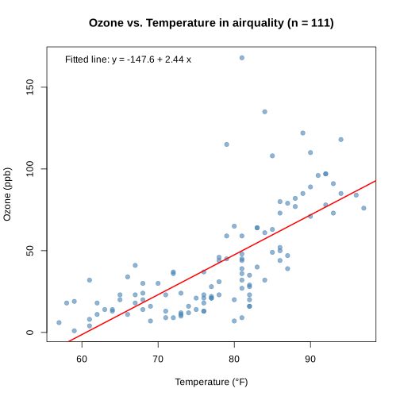
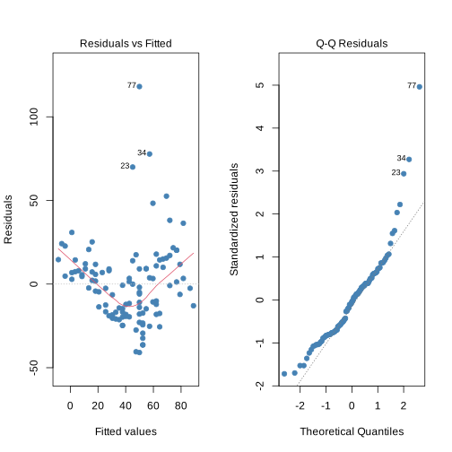
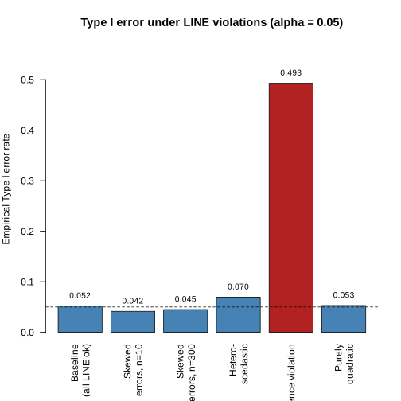
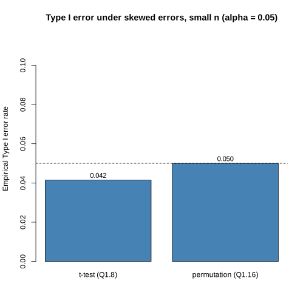
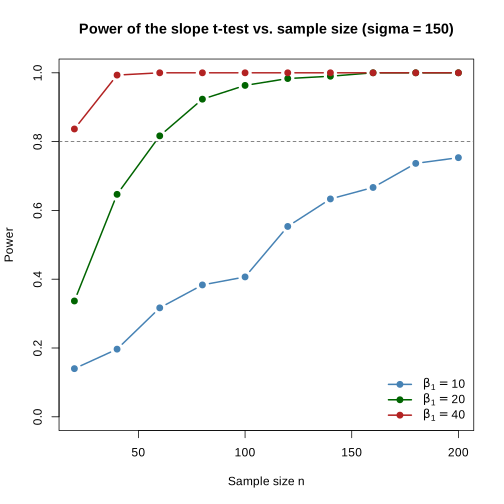
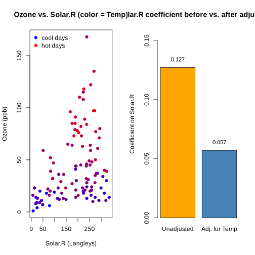
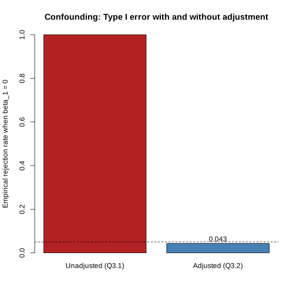
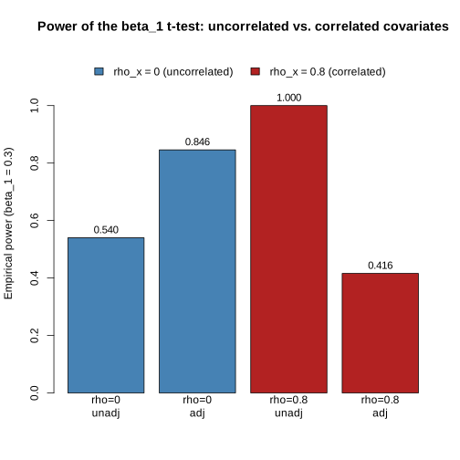

# Lab 4: Statistical Inference in Linear Models

In this lab we explore statistical inference in the linear model setting, using the built-in R `airquality` dataset as a running example throughout. The lab is organized into three parts:

* **Part 1: Simple Linear Regression.** Interpret a fitted simple linear regression of ozone on temperature, check the LINE conditions behind the classical $t$-test for the slope, use simulation to see when the $\alpha = 0.05$ $t$-test is well calibrated and when it breaks down, build a permutation test for $H_0 : \beta_1 = 0$, and estimate statistical power across sample sizes and effect sizes.

* **Part 2: Multiple Regression for Confounder Adjustment.** Observe a concrete example of confounding using `airquality`, where the apparent effect of solar radiation on ozone is substantially inflated until we adjust for temperature. Compare the unadjusted and adjusted regressions and reason about which $p$-value corresponds to which scientific question.

* **Part 3: Simulation of Confounding and Adjustment.** Build on Part 2 by simulating the unadjusted-vs-adjusted comparison from scratch under a known data-generating process, then study the cost of adjustment when the covariates are highly correlated.

### The `airquality` dataset

The `airquality` dataset ships with base R and records 153 daily air-quality measurements taken in the New York metropolitan area between May and September 1973. For this lab we drop the rows with missing values and work with the remaining $n = 111$ complete observations. The columns we will use are `Ozone` (mean ozone in parts per billion), `Solar.R` (solar radiation in Langleys), `Wind` (average wind speed in mph), `Temp` (maximum daily temperature in °F), and `Month`.


```R
# Please run this initialization cell
library(ottr)

aq <- na.omit(airquality)
cat("Rows:", nrow(aq), "\n")
head(aq)
```

    Rows: 111 


<table class="dataframe">
<caption>A data.frame: 6 × 6</caption>
<thead>
	<tr><th></th><th scope=col>Ozone</th><th scope=col>Solar.R</th><th scope=col>Wind</th><th scope=col>Temp</th><th scope=col>Month</th><th scope=col>Day</th></tr>
	<tr><th></th><th scope=col>&lt;int&gt;</th><th scope=col>&lt;int&gt;</th><th scope=col>&lt;dbl&gt;</th><th scope=col>&lt;int&gt;</th><th scope=col>&lt;int&gt;</th><th scope=col>&lt;int&gt;</th></tr>
</thead>
<tbody>
	<tr><th scope=row>1</th><td>41</td><td>190</td><td> 7.4</td><td>67</td><td>5</td><td>1</td></tr>
	<tr><th scope=row>2</th><td>36</td><td>118</td><td> 8.0</td><td>72</td><td>5</td><td>2</td></tr>
	<tr><th scope=row>3</th><td>12</td><td>149</td><td>12.6</td><td>74</td><td>5</td><td>3</td></tr>
	<tr><th scope=row>4</th><td>18</td><td>313</td><td>11.5</td><td>62</td><td>5</td><td>4</td></tr>
	<tr><th scope=row>7</th><td>23</td><td>299</td><td> 8.6</td><td>65</td><td>5</td><td>7</td></tr>
	<tr><th scope=row>8</th><td>19</td><td> 99</td><td>13.8</td><td>59</td><td>5</td><td>8</td></tr>
</tbody>
</table>


The cell above created `aq` — a data frame with 111 rows (the 153 daily observations minus rows with missing values) and the following columns:

| Column | Description |
|--------|-------------|
| `Ozone` | Mean ozone concentration in parts per billion (ppb) |
| `Solar.R` | Solar radiation in Langleys |
| `Wind` | Average wind speed in miles per hour |
| `Temp` | Maximum daily temperature in °F |
| `Month` | Month of observation (5–9, i.e. May–September) |
| `Day` | Day of the month |

## Part 1: Simple Linear Regression

### Setup

We will use the relationship **ozone ∼ temperature** in the airquality data as our motivating example for simple linear regression.

**Question 1.1.** Consider the following (abbreviated) R output from fitting a linear model on the airquality dataset:

```
Coefficients:
              Estimate Std. Error t value Pr(>|t|)    
(Intercept) -147.6461    18.7553  -7.872 2.76e-12 ***
Temp           2.4391     0.2393  10.192  < 2e-16 ***
```

Which of the following best describes the value `2.4391`? Assign `q1_1_ans` to one of: `1`, `2`, `3`, or `4`.

1. It is $\beta_1$, the true population slope: each additional °F of temperature causes exactly a 2.4391 ppb increase in ozone.
2. It is $\hat{\beta}_1$, our estimate of the population slope $\beta_1$ from this particular sample.
3. It is $\hat{\beta}_1$, and because the p-value is extremely small (< 2 x 10^-16), we can be confident that the true population slope $\beta_1$ is exactly 2.4391.
4. It is $\hat{\beta}_1$, the amount of increase in ozone caused by a 1 degree increase in temperature.


```R
q1_1_ans <- 2
```


```R
. = ottr::check("tests/q1_1.R")
```

    All tests passed!


```R
slr_data_q12 <- data.frame(
    x = aq$Temp,
    y = aq$Ozone
)
head(slr_data_q12)
```


<table class="dataframe">
<caption>A data.frame: 6 × 2</caption>
<thead>
	<tr><th></th><th scope=col>x</th><th scope=col>y</th></tr>
	<tr><th></th><th scope=col>&lt;int&gt;</th><th scope=col>&lt;int&gt;</th></tr>
</thead>
<tbody>
	<tr><th scope=row>1</th><td>67</td><td>41</td></tr>
	<tr><th scope=row>2</th><td>72</td><td>36</td></tr>
	<tr><th scope=row>3</th><td>74</td><td>12</td></tr>
	<tr><th scope=row>4</th><td>62</td><td>18</td></tr>
	<tr><th scope=row>5</th><td>65</td><td>23</td></tr>
	<tr><th scope=row>6</th><td>59</td><td>19</td></tr>
</tbody>
</table>


**Question 1.2.** Using the dataset `slr_data_q12`, fit a simple linear regression of `y` on `x`. Extract and store the estimate ($\hat{\beta}_1$), the standard error of the estimate, and the $p$-value for the test of $H_0 : \beta_1 = 0$ into the variables `beta1_hat_q12`, `se_beta1_hat_q12`, and `p_value_beta1_q12`, respectively.


```R
model_q12 <- lm(y ~ x, data = slr_data_q12)
coefs_q12 <- summary(model_q12)$coefficients
beta1_hat_q12 <- coefs_q12["x", "Estimate"]
se_beta1_hat_q12 <- coefs_q12["x", "Std. Error"]
p_value_beta1_q12 <- coefs_q12["x", "Pr(>|t|)"]
```


```R
. = ottr::check("tests/q1_2.R")
```

    All tests passed!

### Visualizing the fit

The cell below plots the temperature–ozone data along with the fitted regression line you computed in Q1.2.


```R
plot(slr_data_q12$x, slr_data_q12$y,
     xlab="Temperature (°F)", ylab="Ozone (ppb)",
     main="Ozone vs. Temperature in airquality (n = 111)",
     pch=19, col=adjustcolor("steelblue", 0.6))
abline(model_q12, col="red", lwd=2)
legend("topleft",
       legend=sprintf("Fitted line: y = %.1f + %.2f x",
                      coef(model_q12)[1], coef(model_q12)[2]),
       bty="n")
```


    

    


**Question 1.3** Based on the scatter plot of Ozone vs. Temperature with the fitted regression line, which observations are accurate? Assign `fit_observations` to a vector of all that apply.

1. Ozone tends to increase with temperature on average.
2. The variability of ozone values appears larger at high temperatures than at low temperatures.
3. Several days at high temperatures have ozone values well above what the line predicts.
4. The points are scattered symmetrically around the line in a band of constant width.


```R
fit_observations <- c(1,2,3)

```


```R
. = ottr::check("tests/q1_3.R")
```

    All tests passed!

**Question 1.4.** Consider the regression `lm(Ozone ~ Temp)` you fit in Q1.2. For each statement below, decide whether it is true or false as applied to this specific analysis. Assign `line_conditions_ans` to a vector containing the numbers of all true statements.

1. With $n = 111$ observations, the Central Limit Theorem helps ensure the sampling distribution of $\hat{\beta}_1$ is approximately normal. Therefore, the $t$-test for the slope remains valid even if the underlying residuals are not perfectly normally distributed.
2. The **E** (equal variance) condition would be violated if ozone were more variable on hot days than on cool days.
3. If we suspect the I (independence) condition fails, perhaps because consecutive days at the same location tend to have correlated ozone levels, the standard `lm()` $t$-test will still produce exactly the correct $p$-value.
4. The **L** (linearity) condition requires that $\beta_1 \neq 0$, i.e. that a real relationship exists. If the true slope were zero, linearity would be violated.


```R
line_conditions_ans <- c(1,2)
```


```R
. = ottr::check("tests/q1_4.R")
```

    All tests passed!

### Residual diagnostics for the LINE conditions

R's `plot()` method on an `lm` object produces the standard diagnostic plots. Below are the two most informative for checking the **L** (linearity), **E** (equal variance), and **N** (normality) conditions: the Residuals-vs-Fitted plot (left) and the Normal Q-Q plot of standardized residuals (right).

> **What is a Q-Q plot?** A Q-Q (quantile–quantile) plot compares the quantiles of one distribution against the quantiles of another. The Normal Q-Q plot here puts the standardized residuals on the y-axis and the corresponding theoretical quantiles of a standard normal distribution on the x-axis. If the residuals are approximately normal, the points fall along the diagonal reference line; systematic departures (curvature, S-shapes, heavy tails) indicate non-normality.


```R
par(mfrow=c(1, 2))
plot(model_q12, which=1, col="steelblue", pch=19)
plot(model_q12, which=2, col="steelblue", pch=19)
par(mfrow=c(1, 1))
```


    

    


**Question 1.5** Inspect the Residuals-vs-Fitted plot (left) for `lm(Ozone ~ Temp)`. Which LINE violations does this plot show clear visible signs of? Assign `resid_fitted_violations` to a vector of all that apply.

1. **L**inearity — the smoother / pattern of residuals deviates noticeably from a flat horizontal line at zero.
2. **I**ndependence — there is a visible time-ordered or sequential pattern in the residuals.
3. **N**ormality — the residuals are visibly skewed or have heavy tails.
4. **E**qual variance — the spread of residuals fans out (or in) systematically with the fitted values.


```R
resid_fitted_violations <- c(1, 4)

```


```R
. = ottr::check("tests/q1_5.R")
```

    All tests passed!

**Question 1.6** Inspect the Normal Q-Q plot of standardized residuals (right) for `lm(Ozone ~ Temp)`. Which LINE violations does this plot show clear visible signs of? Assign `qq_violations` to a vector of all that apply.

1. **L**inearity
2. **I**ndependence
3. **N**ormality
4. **E**qual variance

*Hint: The Q-Q plot is designed to assess one specific LINE condition; the others are assessed by other diagnostic plots.*


```R
qq_violations <- c(3)

```


```R
. = ottr::check("tests/q1_6.R")
```

    All tests passed!

### Type I Error Estimation

In Q1.2 we found a highly significant relationship between temperature and ozone. But how much should we trust that $p$-value? The classical $t$-test for the slope assumes the LINE conditions hold. In this section you will investigate, via simulation, what happens to the Type I error rate when various LINE conditions are violated.

**Question 1.7.** Throughout this section you will run several Type I error simulations. Each one has the same skeleton: simulate `reps` datasets, fit `lm(y ~ x)`, and count rejections at the $\alpha = 0.05$ level. Only the data-generating process changes from one violation to the next. To capture this pattern once, write a reusable helper.

**Part (a).** Write a function `sim_typeI(gen_data, reps, alpha = 0.05, ...)` that:
* takes a function `gen_data` returning a list with components `x` and `y`,
* simulates `reps` datasets by calling `gen_data` (passing along any extra arguments after `reps`),
* fits `lm(y ~ x)` on each, extracts the slope $p$-value, and
* returns the proportion of replications with $p <$ `alpha`.

*Hint: `replicate(reps, { ... })` is a clean way to repeat the inner block; `do.call(gen_data, list(...))` lets you forward extra arguments.*

**Part (b).** Write a baseline data generator `gen_baseline(n, sigma)` for the case where all LINE conditions hold: $x \sim \text{Uniform}(0, 10)$, true slope $\beta_1 = 0$, and residuals $\sim N(0, \sigma^2)$. It should return a list with components `x` and `y`.

**Part (c).** Use them to compute `typeI_baseline <- sim_typeI(gen_baseline, reps = 2000, n = 50, sigma = 2)`. The result should land near $0.05$.


```R
sim_typeI <- function(gen_data, reps, alpha = 0.05, ...) {
  args <- list(...)
  
  rejections <- replicate(reps, {
    dat <- do.call(gen_data, args)
    fit <- lm(dat$y ~ dat$x)
    p_val <- summary(fit)$coefficients[2, 4]
    p_val < alpha
  })
  
  mean(rejections)
}

gen_baseline <- function(n, sigma) {
    x <- runif(n, 0, 10)
    y <- rnorm(n, mean = 0, sd = sigma)
    list(x = x, y = y)
}

set.seed(414) # DO NOT DELETE OR CHANGE THIS LINE!
typeI_baseline <- sim_typeI(gen_baseline, reps = 2000, n = 50, sigma = 2)
typeI_baseline

```


0.052


```R
. = ottr::check("tests/q1_7.R")
```

    All tests passed!

### Helper for the independence-violation simulation

You'll reuse the `sim_typeI` function you just wrote throughout the rest of this section — each remaining simulation just needs a different data-generating function.

For the independence-violation simulation, you need errors that are correlated with the previous error. We provide `gen_dependent_errors` for you below.


```R
# Provided: generates n correlated errors using the recursion
# eps_1 ~ N(0, sigma^2);  eps_i = phi * eps_{i-1} + w_i,  w_i ~ N(0, sigma^2).
# Larger phi (closer to 1) means each error is more strongly tied to the previous one.
gen_dependent_errors <- function(n, sigma, phi) {
    eps <- numeric(n)
    eps[1] <- rnorm(1, 0, sigma)
    for (j in 2:n) eps[j] <- phi * eps[j - 1] + rnorm(1, 0, sigma)
    eps
}

```

**Question 1.8 — Normality Violation.** Use `sim_typeI` with a generator that draws residuals from a skewed $\chi^2_1$ distribution.

Write `gen_skew(n, sigma)` that returns a list with components `x` and `y`, where:
* `x` is drawn from a Uniform(0, 10) distribution.
* The true slope is 0, so `y` equals the residuals.
* The residuals are drawn from $\chi^2_1$, then shifted to mean 0 and scaled to standard deviation `sigma`. *(Hint: `(rchisq(n, df=1) - 1) * (sigma / sqrt(2))`.)*

Then call `sim_typeI` with `reps = 2000` to estimate the empirical Type I error rate at $n = 10$ and $n = 300$ (both with `sigma = 2`). Store these in `typeI_skew_small` and `typeI_skew_large`.


```R
gen_skew <- function(n, sigma) {
  x <- runif(n, 0, 10)
  y <- (rchisq(n, df = 1) - 1) * (sigma / sqrt(2))
  list(x = x, y = y)
}

set.seed(414) # DO NOT DELETE OR CHANGE THIS LINE!
typeI_skew_small <- sim_typeI(gen_skew, reps = 2000, n = 10, sigma = 2)
typeI_skew_small

set.seed(414) # DO NOT DELETE OR CHANGE THIS LINE!
typeI_skew_large <- sim_typeI(gen_skew, reps = 2000, n = 300, sigma = 2)
typeI_skew_large

```


0.0415


0.045


```R
. = ottr::check("tests/q1_8.R")
```

    All tests passed!

**Question 1.9 — Homoskedasticity violation.** Use `sim_typeI` with a generator that produces heteroskedastic residuals.

Write `gen_hetero(n)` that returns a list with components `x` and `y`, where:
* `x` is drawn from a Uniform(0, 10) distribution.
* The true slope is 0.
* The residuals have standard deviation `x + 0.5` (so the spread grows with `x`).

Call `sim_typeI` with `n = 50` and `reps = 2000`, and store the result in `typeI_hetero`.


```R
gen_hetero <- function(n) {
  x <- runif(n, 0, 10)
  y <- rnorm(n, mean = 0, sd = x + 0.5)
  list(x = x, y = y)
}

set.seed(414) # DO NOT DELETE OR CHANGE THIS LINE!
typeI_hetero <- sim_typeI(gen_hetero, reps = 2000, n = 50)
typeI_hetero

```


0.0695


```R
. = ottr::check("tests/q1_9.R")
```

    All tests passed!

**Question 1.10 — Independence violation.** Use `sim_typeI` with a generator that produces residuals where each error is correlated with the previous one (so the independence assumption is violated).

We've provided `gen_dependent_errors(n, sigma, phi)` (above). It generates $n$ errors using the recursion
$$\varepsilon_1 \sim N(0, \sigma^2), \quad \varepsilon_i = \phi \cdot \varepsilon_{i-1} + w_i, \quad w_i \sim N(0, \sigma^2),$$
so consecutive errors are correlated when $\phi \neq 0$.

Use it to write `gen_indep(n, sigma, phi)` returning a list with components `x` and `y`, where:
* `x = seq(0, 10, length.out = n)` (a fixed grid, so order matters).
* The true slope is 0, so `y` equals the dependent-error vector.

Call `sim_typeI` with `n = 50`, `sigma = 2`, `phi = 0.8`, and `reps = 2000`. Store the result in `typeI_indep`.


```R
gen_indep <- function(n, sigma, phi) {
  x <- seq(0, 10, length.out = n)
  y <- gen_dependent_errors(n, sigma, phi)
  list(x = x, y = y)
}

set.seed(414) # DO NOT DELETE OR CHANGE THIS LINE!
typeI_indep <- sim_typeI(gen_indep, reps = 2000, n = 50, sigma = 2, phi = 0.8)
typeI_indep

```


0.493


```R
. = ottr::check("tests/q1_10.R")
```

    All tests passed!

**Question 1.11 — Linearity violation.** Use `sim_typeI` with a generator that produces a quadratic mean structure with no linear trend.

Write `gen_quad(n, sigma)` that returns a list with components `x` and `y`, where:
* `x` is drawn from a Uniform(-5, 5) distribution.
* `y = x^2 +` Gaussian noise with standard deviation `sigma`.

Call `sim_typeI` with `n = 50`, `sigma = 30`, and `reps = 2000`. Store the result in `typeI_quad`.


```R
gen_quad <- function(n, sigma) {
   x <- runif(n, -5, 5)
   y <- x^2 + rnorm(n, mean = 0, sd = sigma)
   list(x = x, y = y)
}

set.seed(414) # DO NOT DELETE OR CHANGE THIS LINE!
typeI_quad <- sim_typeI(gen_quad, reps = 2000, n = 50, sigma = 30)
typeI_quad

```


0.053


```R
. = ottr::check("tests/q1_11.R")
```

    All tests passed!

### Summary: Type I error rate under each LINE violation

Now that we've run all the Type I simulations in this section, we can compare them on a single chart. The dashed horizontal line at 0.05 marks the nominal Type I error rate we would see if the $t$-test were perfectly calibrated. Bars are colored red when the empirical rate is materially different from 0.05 (more than 0.02 off).


```R
violations <- c("Baseline\n(all LINE ok)", "Skewed\nerrors, n=10",
                "Skewed\nerrors, n=300", "Hetero-\nscedastic",
                "Independence violation", "Purely\nquadratic")
rates <- c(typeI_baseline, typeI_skew_small, typeI_skew_large,
           typeI_hetero, typeI_indep, typeI_quad)
cols <- ifelse(abs(rates - 0.05) > 0.02, "firebrick", "steelblue")
old_mar <- par("mar"); par(mar=c(6, 4, 4, 2))
bp <- barplot(rates, names.arg=violations, las=2, col=cols,
              ylab="Empirical Type I error rate",
              main="Type I error under LINE violations (alpha = 0.05)",
              ylim=c(0, max(rates, 0.1) * 1.15))
text(bp, rates + max(rates, 0.05) * 0.04,
     labels=sprintf("%.3f", rates), cex=0.85)
abline(h=0.05, lty=2)
par(mar=old_mar)
```


    

    


**Question 1.12.** Based on your simulations in Q1.7–Q1.11, which violation(s) most severely inflated the Type I error rate above the nominal 0.05? Assign `worst_violations` to a vector of all that apply.

1. Skewed errors at small $n$ (Q1.8)
2. Heteroskedasticity (Q1.9)
3. Independence violations (Q1.10)
4. Quadratic mean structure with no linear trend (Q1.11)


```R
worst_violations <- c(3)
```


```R
. = ottr::check("tests/q1_12.R")
```

    All tests passed!

### The Permutation Test for the Slope

In Q1.7–Q1.11 you saw that the $t$-test for the slope can be badly miscalibrated when the LINE conditions fail. One elegant way around this is the **permutation test**, which you saw in Lab 3 for the two-sample problem. The idea carries over almost exactly the same: if $H_0 : \beta_1 = 0$ is true, then $x$ and $y$ are exchangeable, so permuting $y$ relative to $x$ should give a slope distribution that reflects the null.

Concretely, given observed data $(x_1, y_1), \dots, (x_n, y_n)$ with observed slope $\hat{\beta}_1^{\text{obs}}$:

1. Shuffle the $y$ values to get $y^*$.
2. Compute the slope $\hat{\beta}_1^*$ from $(x, y^*)$.
3. Repeat many times.
4. The **two-sided** $p$-value is the fraction of $|\hat{\beta}_1^*|$ at least as extreme as $|\hat{\beta}_1^{\text{obs}}|$.

After building the permutation test, you will apply it to the `airquality` data from Q1.2.

**Question 1.13.** Write a function `perm_test_slope(x, y, n_perm)` that performs a permutation test for $H_0 : \beta_1 = 0$. The function should return the two-sided permutation $p$-value: permute `y` relative to `x` a total of `n_perm` times, compute the slope each time, and report the fraction of permuted slopes whose absolute value is at least as large as the observed slope.


```R
perm_test_slope <- function(x, y, n_perm) {
    xc <- x - mean(x)
  denom <- sum(xc^2)
  
  obs_slope <- sum(xc * (y - mean(y))) / denom
  
  null_slopes <- replicate(n_perm, {
    y_perm <- sample(y)
    sum(xc * (y_perm - mean(y_perm))) / denom
  })
  
  mean(abs(null_slopes) >= abs(obs_slope))}
```


```R
. = ottr::check("tests/q1_13.R")
```

    All tests passed!

**Question 1.14.** Run your `perm_test_slope` function on the airquality dataset `slr_data_q12` (temperature vs. ozone) using `n_perm = 2000`, and store the resulting $p$-value in `perm_pval_q114`. For comparison, also store the classical $t$-test $p$-value (already computed in Q1.2 as `p_value_beta1_q12`) in `ttest_pval_q114`.


```R
set.seed(414) # DO NOT DELETE OR CHANGE THIS LINE!

perm_pval_q114 <- perm_test_slope(slr_data_q12$x, slr_data_q12$y, n_perm = 2000)
ttest_pval_q114 <- p_value_beta1_q12
perm_pval_q114
ttest_pval_q114
```


0


1.55267722939292e-17


```R
. = ottr::check("tests/q1_14.R")
```

    All tests passed!

### Visualizing the permutation null

The histogram below shows the null distribution of slopes obtained by shuffling `y` relative to `x` 2000 times. The red lines mark $\pm|\hat\beta_1^{\text{obs}}|$ — the permutation $p$-value from Q1.14 is the fraction of permuted slopes that fall in the red tails.


```R
# Reproduce the permutation null for visualization
set.seed(414) # DO NOT DELETE OR CHANGE THIS LINE!
xc_vis <- slr_data_q12$x - mean(slr_data_q12$x)
denom_vis <- sum(xc_vis^2)
obs_slope_vis <- sum(xc_vis * (slr_data_q12$y - mean(slr_data_q12$y))) / denom_vis
null_slopes_vis <- replicate(2000, {
    y_p <- sample(slr_data_q12$y)
    sum(xc_vis * (y_p - mean(y_p))) / denom_vis
})
xrng <- range(c(null_slopes_vis, obs_slope_vis, -obs_slope_vis))
hist(null_slopes_vis, breaks=40, col="lightblue", border="white",
     xlab="Permuted slope",
     main="Permutation null distribution of the slope (n_perm = 2000)",
     xlim=xrng * 1.05)
abline(v=c(-obs_slope_vis, obs_slope_vis), col="red", lwd=2)
legend("topleft", legend="+/- observed slope", col="red", lwd=2, bty="n")
```


    

    


**Question 1.15** Inspect the histogram above showing 2000 permuted slopes, with red lines at $\pm|\hat\beta_1^{\text{obs}}|$. Which statements are accurate? Assign `perm_null_obs` to a vector of all that apply.

1. The null distribution is centered near zero, consistent with $H_0: \beta_1 = 0$.
2. The null distribution is roughly bell-shaped, even though we did not assume normal residuals.
3. The observed slope falls deep in the tails, consistent with a very small two-sided p-value.
4. The shape of the null distribution depends sensitively on whether the LINE conditions hold.


```R
perm_null_obs <- c(1, 2, 3)
```


```R
. = ottr::check("tests/q1_15.R")
```

    All tests passed!

**Question 1.16.** In Question 1.5, you observed that the $t$-test had an unreliable Type I error rate when residuals were drawn from a highly skewed $\chi^2$ distribution at small $n$. Write a function `sim_typeI_perm(n, sigma, reps, n_perm)` that repeats this skewed simulation but uses your `perm_test_slope` instead of the `lm()` $t$-test to obtain the $p$-value.

Call the function with `n = 15`, `sigma = 2`, `reps = 400`, and `n_perm = 400`. Store the result in `typeI_perm_skew`. Compare this result with `typeI_skew_small` from Q1.8—does the permutation test stay better calibrated?


```R
sim_typeI_perm <- function(n, sigma, reps, n_perm) {
    rejections <- replicate(reps, {
    dat <- gen_skew(n, sigma)
    p_val <- perm_test_slope(dat$x, dat$y, n_perm)
    p_val < 0.05
  })
  mean(rejections)
}
set.seed(414) # DO NOT DELETE OR CHANGE THIS LINE!
typeI_perm_skew <- sim_typeI_perm(n = 15, sigma = 2, reps = 400, n_perm = 400)
typeI_perm_skew
```


0.05


```R
. = ottr::check("tests/q1_16.R")
```

    All tests passed!

### $t$-test vs. permutation test under a LINE violation

The bar chart compares the Type I error rate of the classical $t$-test from Q1.8 (under chi-squared errors at $n = 10$) with the permutation test from Q1.16 on the same data-generating process. Both should be close to 0.05 if well-calibrated; the permutation test has no normality requirement.


```R
rates_q116 <- c(typeI_skew_small, typeI_perm_skew)
cols_q116 <- ifelse(abs(rates_q116 - 0.05) > 0.02, "firebrick", "steelblue")
bp <- barplot(rates_q116,
              names.arg=c("t-test (Q1.8)", "permutation (Q1.16)"),
              col=cols_q116, ylab="Empirical Type I error rate",
              main="Type I error under skewed errors, small n (alpha = 0.05)",
              ylim=c(0, max(rates_q116, 0.1) * 1.15))
text(bp, rates_q116 + max(rates_q116, 0.05) * 0.04,
     labels=sprintf("%.3f", rates_q116), cex=0.95)
abline(h=0.05, lty=2)
```


    

    


### Statistical Power for Simple Linear Regression

So far we have focused on the Type I error rate by simulating data where $H_0: \beta_1 = 0$ was true. Now, we shift to understanding statistical power: assuming a real linear relationship exists, how often will our test correctly identify it?

**Question 1.17** Write a function `sim_power_slr(n, beta1, sigma, reps)` that estimates the power of the $\alpha = 0.05$ $t$-test for $H_0 : \beta_1 = 0$.

Generate data under the alternative hypothesis: $y_i = 2 + \beta_1 x_i + \varepsilon_i$ with $\varepsilon_i \sim N(0, \sigma^2)$ and $x \sim \text{Uniform}(0, 10)$ and $\beta_1 \neq 0$. Return the empirical rejection rate.


```R
sim_power_slr <- function(n, beta1, sigma, reps) {
    rejections <- replicate(reps, {
    x <- runif(n, 0, 10)
    y <- 2 + beta1 * x + rnorm(n, mean = 0, sd = sigma)
    fit <- lm(y ~ x)
    p_val <- summary(fit)$coefficients[2, 4]
    p_val < 0.05
  })
  mean(rejections)
}
```


```R
. = ottr::check("tests/q1_17.R")
```

    All tests passed!

**Question 1.18.** Use `sim_power_slr` to estimate the power of the $t$-test when $\beta_1 = 20$, $\sigma = 150$, and $n = 50$, using $1000$ replications. Store your answer in `power_lecture_scenario`.


```R
set.seed(414) # DO NOT DELETE OR CHANGE THIS LINE!

power_lecture_scenario <- sim_power_slr(n = 50, beta1 = 20, sigma = 150, reps = 1000)
power_lecture_scenario
```


0.752


```R
. = ottr::check("tests/q1_18.R")
```

    All tests passed!

**Question 1.19.** Construct three power curves by varying $n$ for each effect size $\beta_1 \in \{10, 20, 40\}$, holding $\sigma = 150$ fixed. 

For each $\beta_1$, evaluate `sim_power_slr` at every $n$ in `n_grid_q119 <- seq(20, 200, by=20)` using `reps = 300`. Store the resulting power vectors in `power_b10_q119`, `power_b20_q119`, and `power_b40_q119`.


```R
set.seed(414) # DO NOT DELETE OR CHANGE THIS LINE!
n_grid_q119 <- seq(20, 200, by = 20)

power_b10_q119 <- sapply(n_grid_q119, function(n) {
  sim_power_slr(n, beta1 = 10, sigma = 150, reps = 300)
})
power_b20_q119 <- sapply(n_grid_q119, function(n) {
  sim_power_slr(n, beta1 = 20, sigma = 150, reps = 300)
})
power_b40_q119 <- sapply(n_grid_q119, function(n) {
  sim_power_slr(n, beta1 = 40, sigma = 150, reps = 300)
})
```


```R
. = ottr::check("tests/q1_19.R")
```

    All tests passed!

### Power curves

Plot the power as a function of sample size $n$ for each of the three $\beta_1$ values you tested in Q1.19. 


```R
matplot(n_grid_q119,
        cbind(power_b10_q119, power_b20_q119, power_b40_q119),
        type="b", pch=19, lty=1, lwd=2,
        col=c("steelblue", "darkgreen", "firebrick"),
        xlab="Sample size n", ylab="Power",
        main="Power of the slope t-test vs. sample size (sigma = 150)",
        ylim=c(0, 1))
abline(h=0.80, lty=2, col="gray40")
legend("bottomright",
       legend=c(expression(beta[1] == 10),
                expression(beta[1] == 20),
                expression(beta[1] == 40)),
       col=c("steelblue", "darkgreen", "firebrick"),
       lwd=2, pch=19, bty="n")
```


    

    


**Question 1.20.** Using your `power_b20_q119` vector from Q1.19, find the smallest $n$ in `n_grid_q119` at which the estimated power for $\beta_1 = 20, \sigma = 150$ first reaches at least 0.80. Store this sample size in `n_for_80_power`.

*If no entry in the grid reaches 0.80, set `n_for_80_power` to the largest $n$ in the grid.*


```R
idx_80_q120 <- which(power_b20_q119 >= 0.80)[1]

if (is.na(idx_80_q120)) {
  idx_80_q120 <- length(n_grid_q119)
}
n_for_80_power <- n_grid_q119[idx_80_q120]
```


```R
. = ottr::check("tests/q1_20.R")
```

    All tests passed!

## Part 2: Multiple Regression for Confounder Adjustment

In Lecture #8, we discussed how a confounding variable can distort the apparent relationship between two other variables. We will investigate a case of this in the `airquality` dataset.

Ozone pollution in the lower atmosphere forms through photochemistry, where sunlight reacts with precursor pollutants to produce ozone. You might therefore expect solar radiation (`Solar.R`) to be strongly associated with ozone; indeed, a simple linear regression of `Ozone` on `Solar.R` gives a highly significant positive slope. However, there is a problem. Sunny days also tend to be hot days, and temperature, independently, is a very strong driver of ozone formation. Consequently, the naive marginal slope of `Ozone` on `Solar.R` conflates the direct solar effect with the indirect effect of sunny days being hot days.

In the questions below, you will quantify the association between solar radiation and ozone in two ways. By calculating the effect both with and without adjusting for temperature, you will see how much of the marginal effect actually reflects the confounder.

The dataset `aq` was created at the top of this notebook. The columns we need for Part 2 are `Ozone`, `Solar.R`, and `Temp`. Run the cell below to create the Part 2 data frame.


```R
# Part 2 data: airquality ozone, solar radiation, and temperature
aq_p2 <- aq[, c("Ozone", "Solar.R", "Temp")]
cat("Rows:", nrow(aq_p2), "\n")
summary(aq_p2)
```

    Rows: 111 


         Ozone          Solar.R           Temp      
     Min.   :  1.0   Min.   :  7.0   Min.   :57.00  
     1st Qu.: 18.0   1st Qu.:113.5   1st Qu.:71.00  
     Median : 31.0   Median :207.0   Median :79.00  
     Mean   : 42.1   Mean   :184.8   Mean   :77.79  
     3rd Qu.: 62.0   3rd Qu.:255.5   3rd Qu.:84.50  
     Max.   :168.0   Max.   :334.0   Max.   :97.00  


**Question 2.1.** Fit two models to the `aq_p2` data frame:

1. An **unadjusted** simple linear regression of `Ozone` on `Solar.R`. Store the fitted model in `fit_unadj_q21` and the slope coefficient on `Solar.R` in `solar_coef_unadj_q21`.
2. An **adjusted** multiple linear regression that adds `Temp` as a second predictor. Store the fitted model in `fit_adj_q21` and the slope coefficient on `Solar.R` in `solar_coef_adj_q21`.

*Observation: If temperature is a real confounder here, you should see the `Solar.R` slope shrink meaningfully once temperature is controlled for.*


```R
fit_unadj_q21 <- lm(Ozone ~ Solar.R, data = aq_p2)
solar_coef_unadj_q21 <- coef(fit_unadj_q21)["Solar.R"]
fit_adj_q21 <- lm(Ozone ~ Solar.R + Temp, data = aq_p2)
solar_coef_adj_q21 <- coef(fit_adj_q21)["Solar.R"]
```


```R
. = ottr::check("tests/q2_1.R")
```

    All tests passed!

### Visualizing the confounding

The scatterplot (left) colors each day by its temperature — notice how high-`Solar.R` days skew toward red (hot). The bar chart (right) compares the `Solar.R` coefficient before and after adjusting for `Temp`; the adjusted coefficient is substantially smaller because some of what looked like a solar effect was really a temperature effect.


```R
par(mfrow=c(1, 2))
# Scatterplot colored by Temp
temp_colors <- colorRampPalette(c("blue", "red"))(100)
temp_bins <- cut(aq_p2$Temp, 100, labels=FALSE)
plot(aq_p2$Solar.R, aq_p2$Ozone,
     col=temp_colors[temp_bins], pch=19,
     xlab="Solar.R (Langleys)", ylab="Ozone (ppb)",
     main="Ozone vs. Solar.R (color = Temp)")
legend("topleft", legend=c("cool days", "hot days"),
       col=c("blue", "red"), pch=19, bty="n")
# Bar chart of coefs
coefs_q21 <- c(Unadjusted=unname(solar_coef_unadj_q21),
               `Adj. for Temp`=unname(solar_coef_adj_q21))
bp2 <- barplot(coefs_q21,
               ylab="Coefficient on Solar.R",
               main="Solar.R coefficient before vs. after adjustment",
               col=c("orange", "steelblue"),
               ylim=c(0, max(coefs_q21) * 1.25))
text(bp2, coefs_q21 + max(coefs_q21) * 0.05,
     labels=sprintf("%.3f", coefs_q21), cex=0.95)
par(mfrow=c(1, 1))
```


    

    


**Question 2.2.** Suppose our scientific question is: *"Among days with similar temperatures, does solar radiation predict ozone?"* Which $p$-value most directly addresses this question? Assign `q2_2_ans` to one of `1`, `2`, or `3`.

1. The $p$-value for `Solar.R` from the **unadjusted** model `lm(Ozone ~ Solar.R)`, because it has fewer covariates and is simpler to interpret.
2. The $p$-value for `Solar.R` from the **adjusted** model `lm(Ozone ~ Solar.R + Temp)`, because this coefficient compares days with different solar radiation at the same temperature.
3. Neither — you should instead report the $p$-value for `Temp`, because temperature is the confounding variable.


```R
q2_2_ans <- 2
```


```R
. = ottr::check("tests/q2_2.R")
```

    All tests passed!

**Question 2.3.** Which of the following is the most precise interpretation of `solar_coef_adj_q21`? Assign `q2_3_ans` to one of `1`, `2`, `3`, or `4`.

1. The expected difference in ozone (in ppb) between any two days in the population that differ by 1 Langley in solar radiation.
2. The causal increase in ozone caused by a 1-Langley increase in solar radiation.
3. The expected difference in ozone (in ppb) between two days with the same temperature that differ by 1 Langley in solar radiation.
4. The correlation between solar radiation and ozone, adjusted for temperature.


```R
q2_3_ans <- 3
```


```R
. = ottr::check("tests/q2_3.R")
```

    All tests passed!

**Question 2.4.** Even though adjusting for temperature substantially attenuated the solar radiation coefficient, a careful scientist will still not claim **causation** from this regression analysis. What is the primary reason? Assign `q2_4_ans` to one of `1`, `2`, `3`, or `4`.

1. Correlational or observational data can suggest associations, but establishing causation typically requires a randomized intervention (e.g., randomly assigning solar radiation levels), which is not possible here.
2. There is no reason to be cautious; once we adjust for the primary confounder, we have established a causal link.
3. The sample size of 111 is insufficient to make a causal claim; we would need a much larger dataset to prove causation.
4. There may still be unmeasured confounders (e.g., wind, humidity, season, or day-of-week pollution patterns) that are correlated with both predictors, and regression can only adjust for variables included in the model.


```R
q2_4_ans <- 1
```


```R
. = ottr::check("tests/q2_4.R")
```

    All tests passed!

**Question 2.5.** Suppose a student proposes the following rule: *"I'll fit the full model first. If the $p$-value on `Temp` is less than 0.05, I'll keep it; otherwise, I'll drop it and report the simple linear regression."*

Based on our discussion of confounders, what is the best critique of this approach? Assign `q2_5_ans` to one of `1`, `2`, or `3`.

1. The rule is sound — using $p$-values to select which variables to keep is the standard way to build a strong model.
2. The rule is flawed because you should always include every available column in a dataset to maximize the $R^2$ of the model.
3. The decision to adjust for a confounder like `Temp` is a scientific decision that should be based on domain knowledge. If we know that temperature influences both solar radiation patterns and ozone formation, we must include it to avoid bias, regardless of its $p$-value in this specific sample.


```R
q2_5_ans <- 3
```


```R
. = ottr::check("tests/q2_5.R")
```

    All tests passed!

## Part 3: Simulation of Confounding and Adjustment

In Part 2, we saw how temperature can distort the apparent relationship between solar radiation and ozone in a real dataset. We will now use simulated data to quantify how confounding impacts the long-run behavior of the $t$-test.

We will consider the following data generating process.

**Data-Generating Process:**
* $x_2 \sim N(0, 1)$
* $x_1 = \rho x_2 + \sqrt{1-\rho^2} \cdot N(0, 1)$
* $y = \beta_1 x_1 + \beta_2 x_2 + \varepsilon$

To isolate the effects of confounding, $x_1$ and $x_2$ are constructed such that the correlation between $x_1$ and $x_2$ is exactly $\rho$ and both have variance $1$ (the underlying details behind this are beyond the scope of this course so don't worry about it)

**Question 3.1.** Using the data-generating process described above (with $\beta_1 = 0$, $\beta_2 = 2$, and assuming standard normal noise $\varepsilon \sim N(0,1)$), write a function `sim_typeI_confound_unadj(n, rho, reps)` that returns the empirical rejection rate for the slope of $x_1$ in the **unadjusted** regression `lm(y ~ x1)`.

Note that $x_1$ has no direct effect on $y$. Call the function with $n = 100$, $\rho = 0.7$, and `reps = 1000`. Store the result in `typeI_confound_unadj`.

*What do you notice about the rejection rate? Is it close to the nominal $\alpha = 0.05$?*


```R
sim_typeI_confound_unadj <- function(n, rho, reps) {
    rejections <- replicate(reps, {
    x2 <- rnorm(n)
    x1 <- rho * x2 + sqrt(1 - rho^2) * rnorm(n)
    y <- 0 * x1 + 2 * x2 + rnorm(n)
    
    fit <- lm(y ~ x1)
    p_val <- summary(fit)$coefficients["x1", "Pr(>|t|)"]
    p_val < 0.05
  })
  mean(rejections)
}
set.seed(414) # DO NOT DELETE OR CHANGE THIS LINE!
typeI_confound_unadj <- sim_typeI_confound_unadj(n = 100, rho = 0.7, reps = 1000)
typeI_confound_unadj
```


1


```R
. = ottr::check("tests/q3_1.R")
```

    All tests passed!

**Question 3.2.** Repeat Q3.1, but now test the slope of $x_1$ in the **adjusted** regression `lm(y ~ x1 + x2)`. Write `sim_typeI_confound_adj(n, rho, reps)` with the same data generating process and call it with $n = 100$, $\rho = 0.7$, `reps = 1000`. Store the result in `typeI_confound_adj`.

*If adjustment fixes the confounding problem, this rate should be close to 0.05.*


```R
sim_typeI_confound_adj <- function(n, rho, reps) {
    rejections <- replicate(reps, {
    x2 <- rnorm(n)
    x1 <- rho * x2 + sqrt(1 - rho^2) * rnorm(n)
    y <- 0 * x1 + 2 * x2 + rnorm(n)
    
    fit <- lm(y ~ x1 + x2)
    p_val <- summary(fit)$coefficients["x1", "Pr(>|t|)"]
    p_val < 0.05
  })
  mean(rejections)
}
set.seed(414) # DO NOT DELETE OR CHANGE THIS LINE!
typeI_confound_adj <- sim_typeI_confound_adj(n = 100, rho = 0.7, reps = 1000)
typeI_confound_adj
```


0.043


```R
. = ottr::check("tests/q3_2.R")
```

    All tests passed!

### Confounding Type I error: unadjusted vs. adjusted

The simulations in Q3.1 and Q3.2 differ only in whether we adjust for the confounder $x_2$. Without adjustment, we reject $H_0: \beta_1 = 0$ almost every time, even though `x1` has *no direct effect* on `y`. After adjustment, the rate drops to the nominal 5%.


```R
rates_q32 <- c(typeI_confound_unadj, typeI_confound_adj)
bp <- barplot(rates_q32,
              names.arg=c("Unadjusted (Q3.1)", "Adjusted (Q3.2)"),
              col=c("firebrick", "steelblue"),
              ylab="Empirical rejection rate when beta_1 = 0",
              main="Confounding: Type I error with and without adjustment",
              ylim=c(0, 1))
text(bp, rates_q32 + 0.02,
     labels=sprintf("%.3f", rates_q32), cex=1.0)
abline(h=0.05, lty=2)
```


    

    


**Question 3.3.** Connect this simulation back to the airquality example from Part 2. Which of the following is the right analogy? Assign `q3_3_ans` to one of `1`, `2`, or `3`.

1. `x1` in Part 3 plays the role of *solar radiation* in the airquality data, and `x2` plays the role of *temperature*. The huge Type I error rate in Q3.1 shows that an unadjusted analysis can make `x1` (solar radiation) look associated with `y` (ozone) even when `x1` has no direct effect, purely because `x1` is correlated with the true driver `x2` (temperature). Adjusting for `x2` in Q3.2 fixes the calibration.
2. `x1` plays the role of *temperature* and `x2` plays the role of *solar radiation*. The Type I error rate of the unadjusted analysis is irrelevant here.
3. The simulations have nothing to do with the `airquality` data because confounding and multiple regression are unrelated topics.


```R
q3_3_ans <- 1
```


```R
. = ottr::check("tests/q3_3.R")
```

    All tests passed!

**Question 3.4** Write a function `sim_power_mlr(n, beta1, beta2, rho_x, sigma, reps)` using the Part 3 data-generating process. For each replicate:
1. Fit the **unadjusted** model `lm(y ~ x1)`.
2. Fit the **adjusted** model `lm(y ~ x1 + x2)`.
3. Record whether the $t$-test for $x_1$ rejects at $\alpha = 0.05$ for each model.

Return a named list with elements `unadj` and `adj` giving the empirical rejection rates.


```R
sim_power_mlr <- function(n, beta1, beta2, rho_x, sigma, reps) {
  unadj_rejections <- logical(reps)
  adj_rejections <- logical(reps)
  
  for (i in 1:reps) {
    x2 <- rnorm(n)
    x1 <- rho_x * x2 + sqrt(1 - rho_x^2) * rnorm(n)
    y <- beta1 * x1 + beta2 * x2 + rnorm(n, mean = 0, sd = sigma)
    
    fit_unadj <- lm(y ~ x1)
    fit_adj <- lm(y ~ x1 + x2)
    
    unadj_rejections[i] <- summary(fit_unadj)$coefficients["x1", "Pr(>|t|)"] < 0.05
    adj_rejections[i] <- summary(fit_adj)$coefficients["x1", "Pr(>|t|)"] < 0.05
  }
  
  list(
    unadj = mean(unadj_rejections),
    adj = mean(adj_rejections)
  )
}
```


```R
. = ottr::check("tests/q3_4.R")
```

    All tests passed!

**Question 3.5.** Call `sim_power_mlr` in two scenarios (`n = 100`, `beta1 = 0.3`, `beta2 = 1`, `sigma = 1`, `reps = 500`):

* Uncorrelated covariates (`rho_x = 0`): store the result in `power_uncor_q35`.
* Correlated covariates (`rho_x = 0.8`): store the result in `power_cor_q35`.

Also extract the adjusted-power scalars into `power_uncor_adj_q35` and `power_cor_adj_q35`. How does correlation between the covariates affect the power of the adjusted test?


```R
set.seed(414) # DO NOT DELETE OR CHANGE THIS LINE!

power_uncor_q35 <- sim_power_mlr(
  n = 100, beta1 = 0.3, beta2 = 1, rho_x = 0, sigma = 1, reps = 500
)
power_cor_q35   <- sim_power_mlr(
  n = 100, beta1 = 0.3, beta2 = 1, rho_x = 0.8, sigma = 1, reps = 500
)
power_uncor_adj_q35 <- power_uncor_q35$adj
power_cor_adj_q35   <- power_cor_q35$adj
```


```R
. = ottr::check("tests/q3_5.R")
```

    All tests passed!

### Power under correlated covariates

Adjustment isn't free. When `x1` and `x2` are highly correlated, the adjusted test loses power because the direct effect of `x1` now has to be estimated while controlling for a near-duplicate variable. The bar chart below compares the unadjusted and adjusted tests under uncorrelated ($\rho_x = 0$) and correlated ($\rho_x = 0.8$) regimes — using the two `sim_power_mlr` runs you computed in Q3.5.


```R
rates_q35 <- c(power_uncor_q35$unadj, power_uncor_q35$adj,
               power_cor_q35$unadj,   power_cor_q35$adj)
bp <- barplot(rates_q35,
              names.arg=c("rho=0\nunadj", "rho=0\nadj",
                          "rho=0.8\nunadj", "rho=0.8\nadj"),
              col=c("steelblue", "steelblue", "firebrick", "firebrick"),
              ylab="Empirical power (beta_1 = 0.3)",
              main="Power of the beta_1 t-test: uncorrelated vs. correlated covariates",
              ylim=c(0, 1.18))
text(bp, rates_q35 + 0.025,
     labels=sprintf("%.3f", rates_q35), cex=0.95)
legend("top", horiz=TRUE, bty="n", inset=c(0, 0.01),
       legend=c("rho_x = 0 (uncorrelated)", "rho_x = 0.8 (correlated)"),
       fill=c("steelblue", "firebrick"))

```


    

    


---

## Congratulations, you are finished!!

To submit your assignment:

1. Select `Kernel -> Restart Kernel and Run All Cells...` to ensure that you have executed all cells, including the test cells, and that all tests passed.
2. Read through the notebook to make sure all cells ran and everything looks as expected.
3. Download your notebook (`File -> Download`) and upload it to Gradescope.
4. Stick around while the Gradescope autograder executes. Look over the output it produces and make sure it is what you expect. The autograder will run your notebook and then re-run all of the tests.
5. Check that you have a confirmation email from Gradescope, and that the confirmation email contains the notebook you intended to submit.
